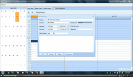
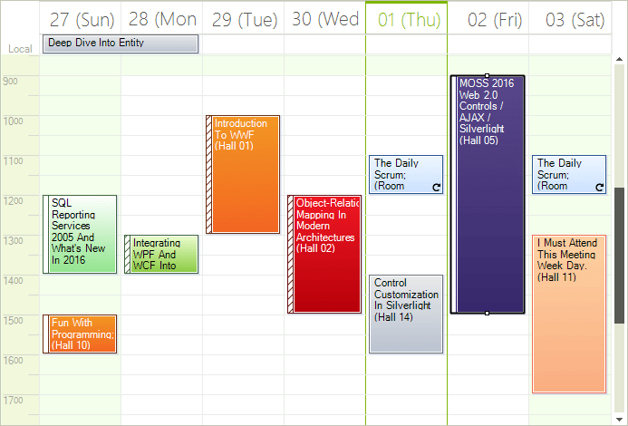

# WinForms Scheduler Overview

| RELATED VIDEOS |  |
| ------ | ------ |
|[Introduction to RadScheduler for WinForms](https://www.telerik.com/videos/winforms/introduction-to-radscheduler-for-winforms-webinar)  In this webinar, Telerik Developer Support Specialist Robert Shoemate will introduce RadScheduler and demonstrate how to utilize its powerful feature set in your own applications. By attending this webinar, you will learn about features such as codeless data binding, adding custom fields, and UI customization. (Runtime: 55:58)||
|[Using RadScheduler for WinForms](https://www.telerik.com/videos/winforms/using-radscheduler-for-winforms) Have you had a need to build scheduler functionality into your applications? If so, then this webinar is for you, where Telerik Evangelist John Kellar shows a variety of features like iCal support, multiple view options, strong data binding support, and an out of the box appointment dialogs. (Runtime: 32:46)||

__RadScheduler__ is a highly-customizable appointment presentation component that offers rich Outlook®-style functionality. When used with __RadReminder__ and __RadDesktopAlert__  you can add rich scheduling UI to any WinForms application and enjoy a lightweight yet highly customizable component.





>caption Figure 1: RadScheduler

# Key Features

* [Day, MultiDay, Week, WorkWeek, Month and Timeline Views]()
* [Powerful Data Binding]()
* [Familiar User Interface and Navigation]()
* [Appointment Capabilities]()
* [End User Capabilities]()
* [Custom Resources and Resource Grouping]()
* [Data Exchange in iCalendar Format]()
* [UI Localization]()
* [Appearance]()

# See Also

* [Design Time]()
* [Data Binding]()
* [Views]()
* [Element Provider]()
