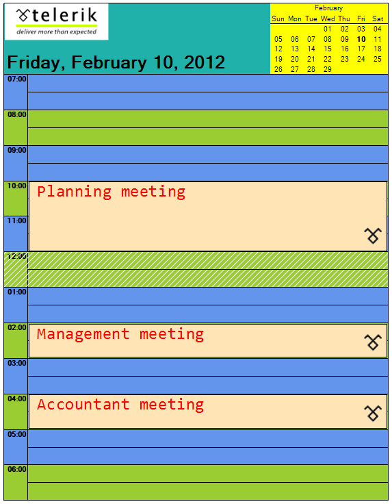

# Events and Customization

__RadScheduler__ provides a set of events that allow you to customize the appearance of the printed elements:

__FormattingEvents__

* __PrintElementFormatting__: Fires when a print element is being formatted before it is printed.

* __CellPrintElementFormatting__: Fires when a cell print element is being formatted before it is printed.

* __AppointmentPrintElementFormatting__: Fires when an appointment print element is being formatted before it is printed.

__PaintEvents__

* __PrintElementPaint__: Fires when a print element is printed.

* __CellPrintElementPaint__: Fires when a cell print element is printed.

* __AppointmentPrintElementPaint__: Fires when an appointment print element is printed.

Here is an example. The comments are inline:

>caption Figure 1: Customized Print Elements


#### Handle Formatting and Paint Events

{{source=..\SamplesCS\Scheduler\Print support\SchedulerEventsAndCustomization.cs region=Customize}} 
{{source=..\SamplesVB\Scheduler\Print support\SchedulerEventsAndCustomization.vb region=Customize}} 

````C#
void radScheduler1_CellPrintElementPaint(object sender, PrintSchedulerCellPaintEventArgs e)
{
    //draw a hatch in the cell if it is 12 o'clock (lunch break)
    if (e.CellElement.Date.Hour == 12)
    {
        Brush b = new HatchBrush(HatchStyle.BackwardDiagonal, Color.White, Color.Transparent);
        e.Graphics.FillRectangle(b, e.Bounds);
    }
}
void radScheduler1_AppointmentPrintElementPaint(object sender, PrintAppointmentPaintEventArgs e)
{
    //draw an image in the bottom right corner of each appointment
    Image img = Resources.telerikLogo1;
    int imgWidth = (int)((double)img.Size.Width * 100 / (double)Graphics.FromImage(img).DpiX);
    int imgheight = (int)((double)img.Size.Height * 100 / (double)Graphics.FromImage(img).DpiX);
    e.Graphics.DrawImage(img, new Point(e.Bounds.Right - imgWidth, e.Bounds.Bottom - imgheight));
}
void radScheduler1_PrintElementPaint(object sender, PrintElementPaintEventArgs e)
{
    if (!(e.PrintElement is CalendarPrintElement))
    {
        //draw an image in the main element
        e.Graphics.DrawImage(Resources.telerikLogo, new Point(e.Bounds.X +1, e.Bounds.Y));
    }
}
void radScheduler1_PrintElementFormatting(object sender, PrintElementEventArgs e)
{
    //allow paint of the main element
    e.PrintElement.DrawFill = true;
    //set the calendar backcolor
    if (e.PrintElement is CalendarPrintElement)
    {
        e.PrintElement.BackColor = Color.Yellow;
    }
    else
    {
        //set the main element backcolor and change its text position
        e.PrintElement.BackColor = Color.LightSeaGreen;
        e.PrintElement.TextAlignment = ContentAlignment.BottomLeft;
    }
}
Font appointmentFont = new Font("Consolas", 20);
void radScheduler1_AppointmentPrintElementFormatting(object sender, PrintAppointmentEventArgs e)
{
    //customize the appointment appearance
    e.AppointmentElement.DrawFill = true;
    e.AppointmentElement.BackColor = Color.Moccasin;
    e.AppointmentElement.ForeColor = Color.Red;
    e.AppointmentElement.Font = appointmentFont;
}
void radScheduler1_CellPrintElementFormatting(object sender, Telerik.WinControls.UI.PrintSchedulerCellEventArgs e)
{
    //set different colors for cells with even and odd hours
    e.CellElement.DrawFill = true;
    if (e.CellElement.Date.Hour % 2 == 0)
    {
        e.CellElement.BackColor = Color.YellowGreen;
    }
    else
    {
        e.CellElement.BackColor = Color.CornflowerBlue;
    }
}

````
````VB.NET
Private Sub radScheduler1_CellPrintElementPaint(sender As Object, e As PrintSchedulerCellPaintEventArgs)
    'draw a hatch in the cell if it is 12 o'clock (lunch break)
    If e.CellElement.[Date].Hour = 12 Then
        Dim b As Brush = New HatchBrush(HatchStyle.BackwardDiagonal, Color.White, Color.Transparent)
        e.Graphics.FillRectangle(b, e.Bounds)
    End If
End Sub
Private Sub radScheduler1_AppointmentPrintElementPaint(sender As Object, e As PrintAppointmentPaintEventArgs)
    'draw an image in the bottom right corner of each appointment
    Dim img As Image = My.Resources.telerikLogo1
    Dim imgWidth As Integer = CInt(CDbl(img.Size.Width) * 100 / CDbl(Graphics.FromImage(img).DpiX))
    Dim imgheight As Integer = CInt(CDbl(img.Size.Height) * 100 / CDbl(Graphics.FromImage(img).DpiX))
    e.Graphics.DrawImage(img, New Point(e.Bounds.Right - imgWidth, e.Bounds.Bottom - imgheight))
End Sub
Private Sub radScheduler1_PrintElementPaint(sender As Object, e As PrintElementPaintEventArgs)
    If Not (TypeOf e.PrintElement Is CalendarPrintElement) Then
        'draw an image in the main element
        e.Graphics.DrawImage(My.Resources.telerikLogo, New Point(e.Bounds.X + 1, e.Bounds.Y))
    End If
End Sub
Private Sub radScheduler1_PrintElementFormatting(sender As Object, e As PrintElementEventArgs)
    'allow paint of the main element
    e.PrintElement.DrawFill = True
    'set the calendar backcolor
    If TypeOf e.PrintElement Is CalendarPrintElement Then
        e.PrintElement.BackColor = Color.Yellow
    Else
        'et the main element backcolor and change its text position
        e.PrintElement.BackColor = Color.LightSeaGreen
        e.PrintElement.TextAlignment = ContentAlignment.BottomLeft
    End If
End Sub
Private appointmentFont As New Font("Consolas", 20)
Private Sub radScheduler1_AppointmentPrintElementFormatting(sender As Object, e As PrintAppointmentEventArgs)
    'customize the appointment appearance
    e.AppointmentElement.DrawFill = True
    e.AppointmentElement.BackColor = Color.Moccasin
    e.AppointmentElement.ForeColor = Color.Red
    e.AppointmentElement.Font = appointmentFont
End Sub
Private Sub radScheduler1_CellPrintElementFormatting(sender As Object, e As Telerik.WinControls.UI.PrintSchedulerCellEventArgs)
    'set different colors for cells with even and odd hours
    e.CellElement.DrawFill = True
    If e.CellElement.[Date].Hour Mod 2 = 0 Then
        e.CellElement.BackColor = Color.YellowGreen
    Else
        e.CellElement.BackColor = Color.CornflowerBlue
    End If
End Sub

````

{{endregion}} 

# See Also

* [RadPrintDocument]()
* [PrintPreviewDialog]()
* [Customize RadPrintDocument]()
* [Views]()