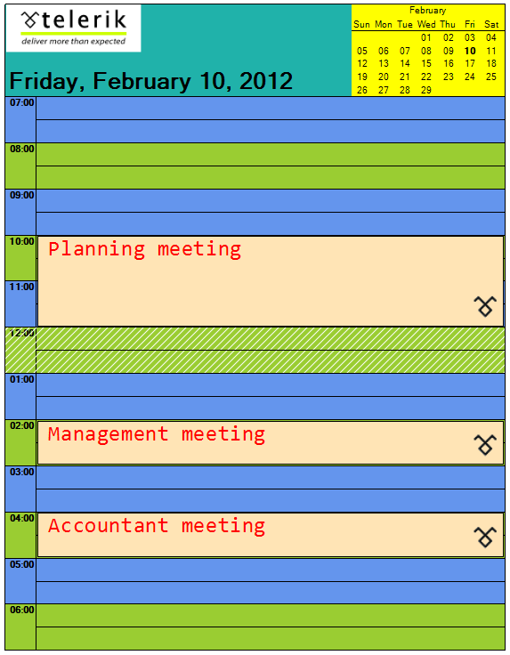

# Events and Customization

__RadScheduler__ provides a set of events that allow you to customize the appearance of the printed elements:

__FormattingEvents__

* __PrintElementFormatting__: Fires when a print element is being formatted before it is printed.

* __CellPrintElementFormatting__: Fires when a cell print element is being formatted before it is printed.

* __AppointmentPrintElementFormatting__: Fires when an appointment print element is being formatted before it is printed.

__PaintEvents__

* __PrintElementPaint__: Fires when a print element is printed.

* __CellPrintElementPaint__: Fires when a cell print element is printed.

* __AppointmentPrintElementPaint__: Fires when an appointment print element is printed.

Here is an example. The comments are inline:

>caption Figure 1: Customized Print Elements

#### Handle Formatting and Paint Events

<snippet id='scheduler-schedulereventsandcustomization-customize-cs' />
<snippet id='scheduler-schedulereventsandcustomization-customize-vb' />

# See Also

* [RadPrintDocument]()
* [PrintPreviewDialog]()
* [Customize RadPrintDocument]()
* [Views]()
