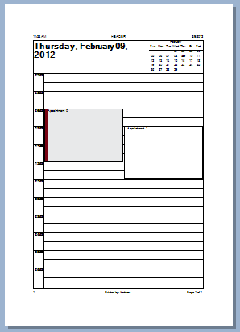
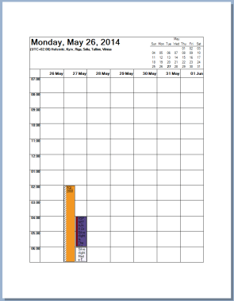
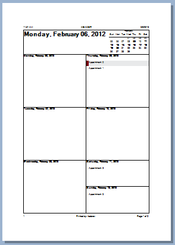
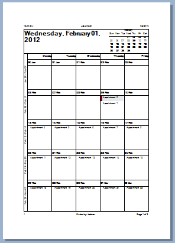
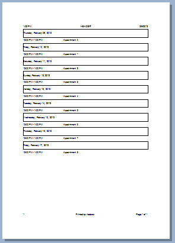

# SchedulerPrintStyles

Printing in __RadScheduler__ is performed by objects of type __SchedulerPrintStyle__. The print style object provides a set of options that define the date range of printing and the appearance of the printed pages.      

__SchedulerPrintStyle__ is an abstract class and cannot be instantiated directly. You should use one of the following implementations: __SchedulerDailyPrintStyle__,__SchedulerWeeklyPrintStyle__, __SchedulerMonthlyPrintStyle__, __SchedulerDetailsPrintStyle__.

>note When applying a specific **PrintStyle** make sure that you set the relevant **ActiveViewType** for **RadScheduler**.

To set a __RadScheduler__ with a print style:

#### Daily Print Style

<snippet id='scheduler-schedulerprintstyle1-setprintstyle-cs' />
<snippet id='scheduler-schedulerprintstyle1-setprintstyle-vb' />

__SchedulerPrintStyle__ has the following properties:

* __DateStartRange__ and __DateEndRange__: Allows you to specify the date range which should be printed:

#### Specify Date Range

<snippet id='scheduler-schedulerprintstyle1-speficydaterange-cs' />
<snippet id='scheduler-schedulerprintstyle1-speficydaterange-vb' />

* __TimeStartRange__ and __TimeEndRange__: Allows you to specify the time frame which for every day in the date range - i.e. the time frame which will be printed for each date in the date range period:

#### Specify Time Frame

<snippet id='scheduler-schedulerprintstyle1-specifytimeframe-cs' />
<snippet id='scheduler-schedulerprintstyle1-specifytimeframe-vb' />

* __AppointmentFont__, __DateHeadingFont__ and __PageHeadingFont__ allow you to specify the fonts for the appointments, dates and page headers respectively:

#### Set Font

<snippet id='scheduler-schedulerprintstyle1-setfonts-cs' />
<snippet id='scheduler-schedulerprintstyle1-setfonts-vb' />

* You can also specify which __visual parts__ of the page to be printed - page title, calendar in the page title, notes area, etc:

#### Specify Visual Parts

<snippet id='scheduler-schedulerprintstyle1-speficyvisualelements-cs' />
<snippet id='scheduler-schedulerprintstyle1-speficyvisualelements-vb' />

* To modify the size of the visual areas use:

#### Area Size

<snippet id='scheduler-schedulerprintstyle1-modifyvisualelements-cs' />
<snippet id='scheduler-schedulerprintstyle1-modifyvisualelements-vb' />

## DailyStyle

>caption Figure 1: SchedulerDailyPrintStyle

The __SchedulerDailyPrintStyle__ class defines printing of RadScheduler in a daily manner. Each day is displayed on a separate page. The appointments are arranged in a grid similarly to the __SchedulerDayView__. The SchedulerDailyPrintStyle provides properties for changing the size of its specific visual parts: the hours column on the left and the area for all day appointments. Additionally, you can allow printing two pages per day. The second page in the mode is reserved for notes.

#### Set SchedulerDailyPrintStyle

<snippet id='scheduler-schedulerprintstyle1-dailystyle-cs' />
<snippet id='scheduler-schedulerprintstyle1-dailystyle-vb' />

## WeeklyCalendarStyle

>caption Figure 2: SchedulerWeeklyCalendarPrintStyle

In the WeeklyCalendarPrintStyle the appointments are arranged in a grid where each column represents a day. And each row represents a specific time frame.  This style provides properties for changing the dimensions of its visual parts and the font for the header cells. 

* __HeaderCellFont__: Allows the font of the header row to be changed.            

* __HeaderAreaHeight__: Controls the height of the header row.            

* __HoursColumnWidth__: Controls the width of the header column.            

* __AllDayAppointmentHeight__: Controls the width of the all day appointments section.
            
* __MaxAllDayAreaHeight__: Sets the maximum height all day appointments section. The default value is 180 pixels.

#### Set SchedulerWeeklyCalendarPrintStyle

<snippet id='scheduler-schedulerprintstyle1-weeklycalendarstyle-cs' />
<snippet id='scheduler-schedulerprintstyle1-weeklycalendarstyle-vb' />

## WeeklyStyle

>caption Figure 3: SchedulerWeeklyPrintStyle

The SchedulerWeeklyPrintStyle class defines printing of RadScheduler in a weekly manner. Each week is displayed on a separate page. The appointments are arranged in a grid in which each cell represents a day of the week. The SchedulerWeeklyPrint provides properties for changing the height of the appointments and the layout of its visual parts.
        
* __ExcludeNonWorkingDays__: Disables printing of non-working days

* __DaysLayout__: Defines the flow direction of the cells

* __TwoPagesPerWeek__: Allows printing a week in two pages separating the week in two.

#### Set SchedulerWeeklyPrintStyle

<snippet id='scheduler-schedulerprintstyle1-weeklystyle-cs' />
<snippet id='scheduler-schedulerprintstyle1-weeklystyle-vb' />

## MonthlyStyle

>caption Figure 4: SchedulerMonthlyPrintStyle

The SchedulerMonthlyPrintStyle class defines printing of RadScheduler in a monthly manner. Each month is displayed on a separate page. The appointments are arranged in a grid in  which each cell represents a day of the month.
        
In this mode you can take advantage of the following properties:

* __ExcludeNonWorkingDays__: Disable printing of non-working days            

* __TwoPagesPerMonth__: Separate the month in two pages            

* __PrintExactlyOneMonth__: Prints one month on a page            

* __WeeksPerPage__: Prints the number of defined weeks on a page            

* __AppointmentHeight__: Set the appointment height            

* __VerticalHeaderWidth__: Sets the vertical header width            

* __CellHeaderHeight__: Sets cell header height

#### Set SchedulerMonthlyPrintStyle

<snippet id='scheduler-schedulerprintstyle1-monthlystyle-cs' />
<snippet id='scheduler-schedulerprintstyle1-monthlystyle-vb' />

## DetailsStyle

>caption Figure 5: SchedulerDetailsPrintStyle

The __SchedulerDetailsPrintStyle__ defines printing of RadScheduler in a continuous manner. Appointments are printed in ascending order of their start date. This mode does not provide page headers.        

Similar to the previous modes, you can set properties that define the size of specific visual parts  of the page. You can also specify the condition under which the printing should continue on the next page. Four page break modes are available:

* __Default__: The printing continues to the next page there is no space left on the current page.            

* __Day__: The printing continues to the next page when the next appointment has a different date or there is no space left on the current page.            

* __Week__: The printing continues to the next page when the next appointment is in a different week or there is no space left on the current page.            

* __Month__: The printing continues to the next page when the next appointment is in a different month or there is no space left on the current page.

#### Set SchedulerDetailsPrintStyle

<snippet id='scheduler-schedulerprintstyle1-detailsstyle-cs' />
<snippet id='scheduler-schedulerprintstyle1-detailsstyle-vb' />

# See Also

* [RadPrintDocument]()
* [PrintPreviewDialog]()
* [Customize RadPrintDocument]()
* [Views]()
