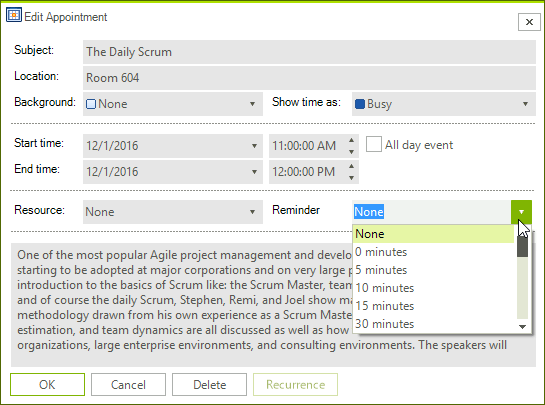

# RadSchedulerReminder

__RadSchedulerReminder__ represents a special reminder object for the appointments that are collected in __RadScheduler__. This component inherits from RadReminder.

## Properties

* __AssociatedScheduler__: Gets the RadScheduler object associated with the RadSchedulerReminder.

* __StartReminderInterval__ and __EndReminderInterval__: Determines the time interval of the reminder. RadSchedulerReminder reminds you of only those appointments which are started in the defined interval. The default interval is Today.

## Getting Started

In order to incorporate __RadSchedulerReminder__ in your application, please follow to the steps below.
1\. Initialize the RadSchedulerReminder from code or in the designer.

<snippet id='scheduler-schedulerreminder-creating-cs' />
<snippet id='scheduler-schedulerreminder-creating-vb' />

2\. Set __AssociatedScheduler__ property.

<snippet id='scheduler-schedulerreminder-associatedscheduler-cs' />
<snippet id='scheduler-schedulerreminder-associatedscheduler-vb' />

3\. Set StartReminderInterval and EndReminderInterval.

<snippet id='scheduler-schedulerreminder-interval-cs' />
<snippet id='scheduler-schedulerreminder-interval-vb' />

4\. You should set the reminder property of the appointment. This property indicates how much time before the appointment start, the reminder will be shown. For example you can initialize and add an appointment with the following code.

<snippet id='scheduler-schedulerreminder-reminder-cs' />
<snippet id='scheduler-schedulerreminder-reminder-vb' />

Also you can set this in AppointmentEditDialog at runtime.

>caption Figure 1: RadScheduler Reminder

When you start RadSchedulerReminder it will be filled with the appointment that starts in this interval. When you stop it all reminders will be cleared from the RadSchedulerReminder.

# See Also

* [Views]()
* [Working with Appointments]()
* [Localizing RadScheduler]()
* [Themes and Appearance]()
