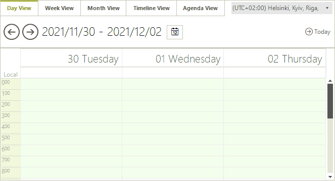

# Date Selector

As of **R3 2021 SP1**, RadSchedulerNavigator offers a date selector.

>caption Figure 1: Date Selector in RadSchedulerNavigator

Selecting a date inside the calendar will change the start date of the active view. 

By default the drop-down button is visible. This can be controlled by the RadSchedulerNavigator.**DateSelectorButtonVisible** property. The button is also exposed in the control by the RadSchedulerNavigator.**DateSelectorButton** property. 

The SchedulerNavigatorElement.**DateSelectorCalendar** property gives you access to the [RadCalendar]() control that is used in the popup. It is possible to customize its settings as it is done in RadCalendar. The RadSizablePopupControl can be accessed by the SchedulerNavigatorElement.**DateSelectorPopup** property.

>note When using a multi-day view, selecting a date inside the calendar will clear the **Intervals** collection. The same also happens when the user navigates back and forth using the prev/next buttons.
