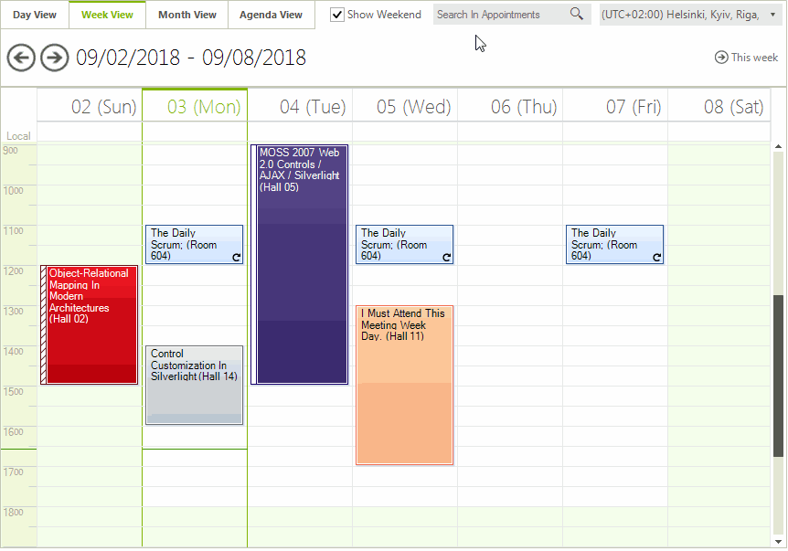

# Search

Similar to Outlook calendar, in **R1 2018** we introduced search functionality in **RadScheduler**. A search text box is located in **RadSchedulerNavigator** next to the time zones drop down.

>caption Figure 1: Search box in RadSchedulerNavigator

The user can enter some search criteria in the text box. Then, a [RadGridView]() with the search results will be displayed in **RadScheduler**.
 
# Search Properties and Events in RadSchedulerNavigator

* **SearchCompleted** - this event is fired after the search functionality is completed. You can get the filtered result by the SearchGrid.**ChildRows** collection.

* SchedulerNavigatorElement.**SearchTextBox** - gives you access to the search text box. By default, the **NullText** in the search text box is *"Search In Appointments"*. You can change it by specifying the SchedulerNavigatorStringId.**SearchInAppointments** text in the [SchedulerNavigatorLocalizationProvider](). 

* SchedulerNavigatorElement.**SearchGrid** - gives you access to the search grid.
