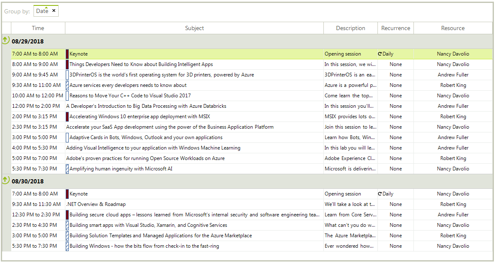
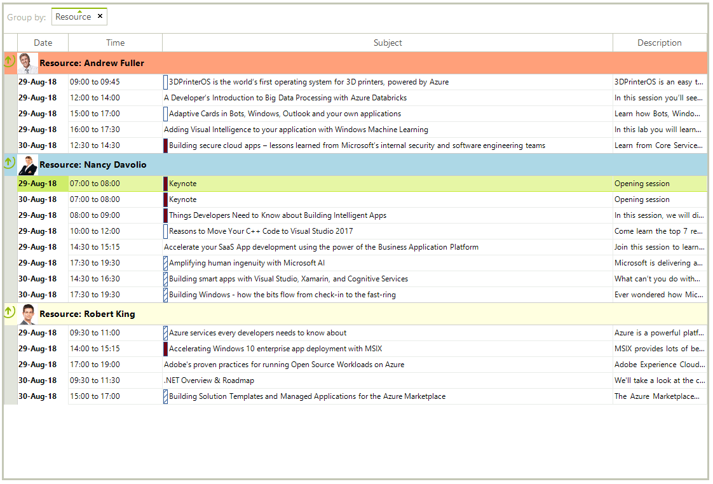

# Agenda View

Agenda View is a table, structured like a simple list, which lists appointments for a specific period of time that is defined by the property **DayCount**. Note that each **Appointment** represents a separate row. Unlike the other available views in the **RadScheduler**, it doesn’t have empty rows/cells representing time slots since days with no appointments are not shown. Therefore, the user is not able to move or resize appointments. However, inserting and editing is allowed and a delete operation could be achieved by pressing the `Delete` key when a certain appointment is selected.

>caption Figure 1: RadScheduler in Agenda View



## Set Agenda View

The Agenda View can be set to be the default view which the user sees by setting the RadScheduler.**ActiveViewType** property: 

{{source=..\SamplesCS\Scheduler\Views\AgendaView.cs region=SetView}} 
{{source=..\SamplesVB\Scheduler\Views\AgendaView.vb region=SetView}} 

````C#
this.radScheduler1.ActiveViewType = Telerik.WinControls.UI.SchedulerViewType.Agenda;

````
````VB.NET
Me.radScheduler1.ActiveViewType = Telerik.WinControls.UI.SchedulerViewType.Agenda

````

{{endregion}} 

## Get Agenda View

To get the instance of the **SchedulerAgendaView** from the **RadScheduler** object, you can either use the **GetAgendaView** method or get the **ActiveView** property:


{{source=..\SamplesCS\Scheduler\Views\AgendaView.cs region=GetAgendaView}} 
{{source=..\SamplesVB\Scheduler\Views\AgendaView.vb region=GetAgendaView}} 

````C#
SchedulerAgendaView agendaView = this.radScheduler1.ActiveView as SchedulerAgendaView;
//or 
agendaView = this.radScheduler1.GetAgendaView();

````
````VB.NET
Dim agendaView As SchedulerAgendaView = TryCast(Me.radScheduler1.ActiveView, SchedulerAgendaView)
'or
agendaView = Me.radScheduler1.GetAgendaView()

````

{{endregion}} 

>note This method returns *null* if the active view of the **RadScheduler** is not **SchedulerAgendaView**.

## Get the Content Grid

**SchedulerAgendaView** internally uses a [RadGridView]() to display the available records. It can be accessed through the SchedulerAgendaViewElement.**Grid** property. Feel free to use the whole API that **RadGridView** offers to achieve any custom requirements that you have. 

{{source=..\SamplesCS\Scheduler\Views\AgendaView.cs region=GetGrid}} 
{{source=..\SamplesVB\Scheduler\Views\AgendaView.vb region=GetGrid}} 

````C#
SchedulerAgendaViewElement agendaViewElement = this.radScheduler1.SchedulerElement.ViewElement as SchedulerAgendaViewElement;
RadGridView agendaGrid = agendaViewElement.Grid;

````
````VB.NET
Dim agendaViewElement As SchedulerAgendaViewElement = TryCast(Me.radScheduler1.SchedulerElement.ViewElement, SchedulerAgendaViewElement)
Dim agendaGrid As RadGridView = agendaViewElement.Grid

````

{{endregion}} 

## SchedulerAgendaView Properties

|Property|Description|
|----|----|
|**ViewType**|Returns *SchedulerViewType.Agenda*.|
|**GroupByDate**|Gets or sets a value indicating whether the agenda is grouped by date. Its default value is *false*.|
|**DayCount**|Gets or sets the number of days displayed in the view. Its default value is *1*.|

## SchedulerAgendaViewElement Properties

|Property|Description|
|----|----|
|**Grid**|Gets the **RadGridView** that shows the appointments.|
|**ResourceHeaderHeight**|Gets or sets the height of the resource header.|

## Grouping by Resources

Since **SchedulerAgendaView** uses a **RadGridView**, it supports grouping by different columns. You can drag any of the grid's header cells and drop it onto the group panel. By default, **SchedulerAgendaView** is grouped by date. You can remove the date's grouping by clicking the `x` button of the group item and drag and drop the **Resource** column:

>caption Figure 2: Agenda View Grouped by Resources


In order to group the **SchedulerAgendaView** by resources programmatically it is necessary to add a [GroupDescriptor]() to the grid for the **Resource** property:

{{source=..\SamplesCS\Scheduler\Views\AgendaView.cs region=GroupByResources}} 
{{source=..\SamplesVB\Scheduler\Views\AgendaView.vb region=GroupByResources}} 

````C#
GroupDescriptor descriptor = new GroupDescriptor();
descriptor.GroupNames.Add("Resource", ListSortDirection.Ascending);
agendaViewElement.Grid.GroupDescriptors.Add(descriptor);

````
````VB.NET
Dim descriptor As GroupDescriptor = New GroupDescriptor()
descriptor.GroupNames.Add("Resource", ListSortDirection.Ascending)
agendaViewElement.Grid.GroupDescriptors.Add(descriptor)

````

{{endregion}}

>caption Figure 3: Agenda View Grouped by Resources



# See Also

* [Common Visual Properties]()
* [Working with Views]()
* [Views Walkthrough]()
* [Grouping by Resources]()
* [Exact Time Rendering]()

