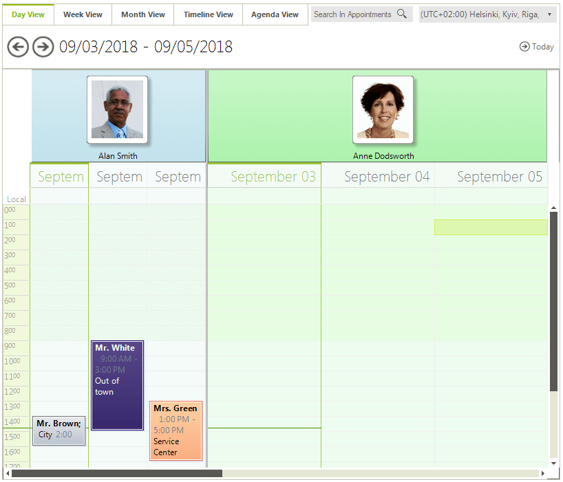
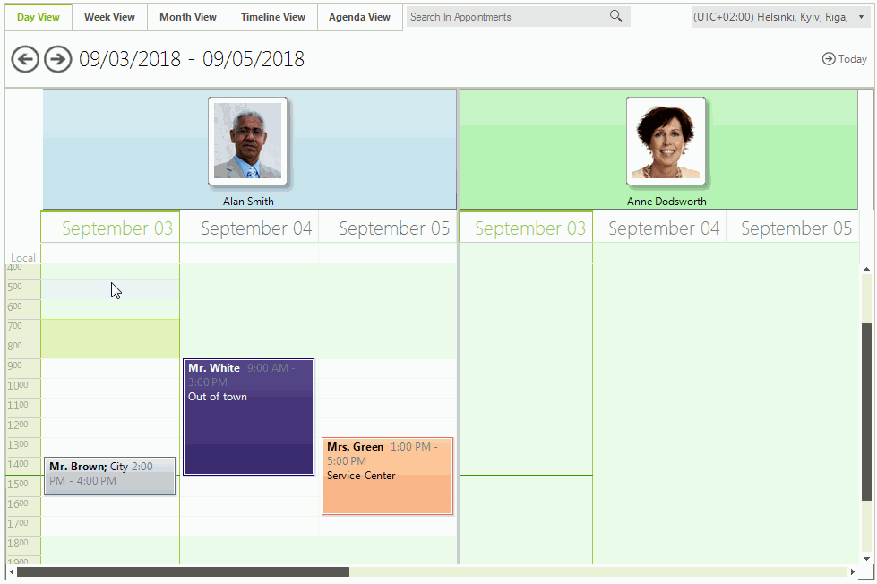
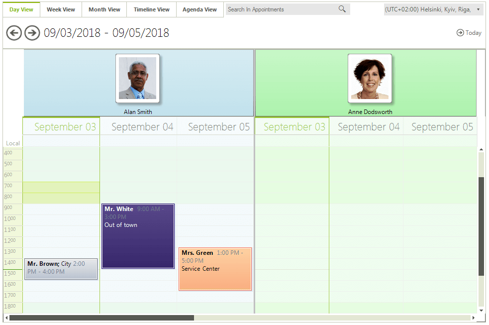
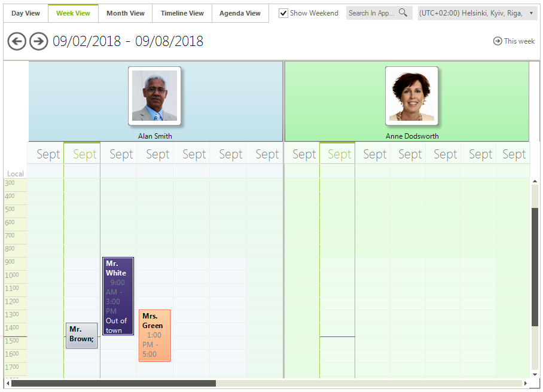
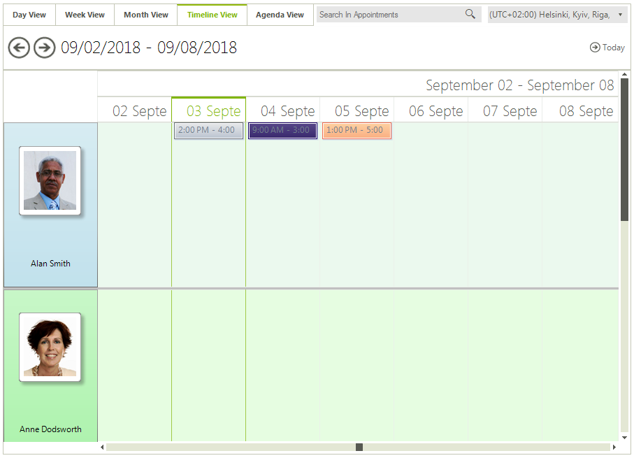
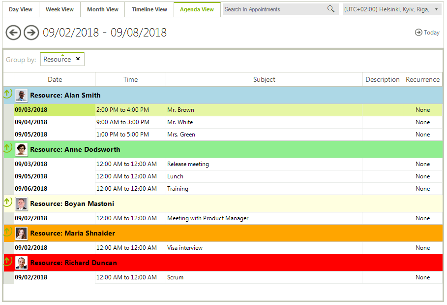

# Grouping by Resources


|RELATED VIDEOS|RELATED BLOGS|
|-----|-----|
|Resource Grouping in the RadSchedulerIn this webinar, Telerik Developer Support Specialist Robert Shoemate will introduce RadScheduler and demonstrate how to utilize its powerful feature set in your own applications. By attending this webinar, you will learn about features such as codeless data binding, adding custom fields, and UI customization.[(Runtime: 55:58)](http://www.telerik.com/videos/winforms/resource-grouping-in-the-radscheduler)|Telerik UI for WinForms R3 2009 - RadScheduler Resource Grouping R3 marks the release of some fantastic new features in the Telerik UI for WinForms. I know many of you have been waiting for one feature in particular... resource grouping. Well, I'm happy to say, the wait is over, resource grouping is here! Today, I am going to take some time out to explain to you how it works.[Read full post ...](http://blogs.telerik.com/RobertShoemate/Posts/09-11-05/radcontrols_for_winforms_q3_2009_-_radscheduler_resource_grouping.aspx)|

## Setting Up Grouping

The __RadScheduler__ control allows you to define custom resources that can be assigned to the appointments. Custom resources let you associate additional information with your appointments. Since custom resources have a limited number of values, RadScheduler can group appointments based on the resources associated with them. For example, you can book different facilities for a variety of events.

If you want to group RadScheduler by resources you can use the __GroupType__ property. It has two available values – None and Resources.

#### Group by Resources

{{source=..\SamplesCS\Scheduler\Views\GroupingByResources.cs region=groupType}} 
{{source=..\SamplesVB\Scheduler\Views\GroupingByResources.vb region=groupType}} 

````C#
this.radScheduler1.GroupType = GroupType.Resource;

````
````VB.NET
Me.RadScheduler1.GroupType = GroupType.Resource

````

{{endregion}} 

You can add/remove resources using the RadScheduler’s Resources collection. The resources in __RadScheduler__ for Winforms are represented by the Resource class and you can assign it text, color and image values.

#### Resources Collection

{{source=..\SamplesCS\Scheduler\Views\GroupingByResources.cs region=addingResources}} 
{{source=..\SamplesVB\Scheduler\Views\GroupingByResources.vb region=addingResources}} 

````C#
Color[] colors = new Color[]{Color.LightBlue, Color.LightGreen, Color.LightYellow,
   Color.Red, Color.Orange, Color.Pink, Color.Purple, Color.Peru, Color.PowderBlue};
string[] names = new string[]{"Alan Smith", "Anne Dodsworth",
   "Boyan Mastoni", "Richard Duncan", "Maria Shnaider"};
for (int i = 0; i < names.Length; i++)
{
    Resource resource = new Resource();
    resource.Id = new EventId(i);
    resource.Name = names[i];
    resource.Color = colors[i];
    resource.Image = this.imageList1.Images[i];
    this.radScheduler1.Resources.Add(resource);
}

````
````VB.NET
Dim colors() As Color = {Color.LightBlue, Color.LightGreen, Color.LightYellow, Color.Red, Color.Orange, Color.Pink, Color.Purple, Color.Peru, Color.PowderBlue}
Dim names() As String = {"Alan Smith", "Anne Dodsworth", "Boyan Mastoni", "Richard Duncan", "Maria Shnaider"}
For i As Integer = 0 To names.Length - 1
    Dim resource As New Telerik.WinControls.UI.Resource()
    resource.Id = New EventId(i)
    resource.Name = names(i)
    resource.Color = colors(i)
    resource.Image = Me.imageList1.Images(i)
    Me.RadScheduler1.Resources.Add(resource)
Next i

````

{{endregion}} 

## Setting the Number of Displayed Resources

You can use the view’s __ResourcesPerView__ property to change the number of visible resources.

#### Resources Count

{{source=..\SamplesCS\Scheduler\Views\GroupingByResources.cs region=getDayView}} 
{{source=..\SamplesVB\Scheduler\Views\GroupingByResources.vb region=getDayView}} 

````C#
this.radScheduler1.ActiveView.ResourcesPerView = 2;

````
````VB.NET
Me.RadScheduler1.ActiveView.ResourcesPerView = 2

````

{{endregion}} 

## Navigating Through Resources

Navigating through resources To navigate to a specific resource you can use the __ResourceStartIndex__ property. To access it, you first need to cast the ViewElement to the base type for all grouped views – __SchedulerViewGroupedByResourceElementBase__.

#### Resource Start Index

{{source=..\SamplesCS\Scheduler\Views\GroupingByResources.cs region=resourceNavigation}} 
{{source=..\SamplesVB\Scheduler\Views\GroupingByResources.vb region=resourceNavigation}} 

````C#
((SchedulerViewGroupedByResourceElementBase)this.radScheduler1.ViewElement).ResourceStartIndex = 2;

````
````VB.NET
CType(Me.RadScheduler1.ViewElement, SchedulerViewGroupedByResourceElementBase).ResourceStartIndex = 2

````

{{endregion}}

To track when the resource index is changed, you can use the ResourceStartIndexChanging and ResourceStartIndexChanged events. The first one is fired before the index is actually changed and allows you to cancel the action. The second one is fired when the index has changed and the view was updated.

#### Track Index Changes

{{source=..\SamplesCS\Scheduler\Views\GroupingByResources.cs region=resourceNavigationEvents}} 
{{source=..\SamplesVB\Scheduler\Views\GroupingByResources.vb region=resourceNavigationEvents}} 

````C#
this.radScheduler1.ResourceStartIndexChanging += radScheduler1_ResourceStartIndexChanging;
this.radScheduler1.ResourceStartIndexChanged += radScheduler1_ResourceStartIndexChanged;

````
````VB.NET
AddHandler Me.RadScheduler1.ResourceStartIndexChanging, AddressOf radScheduler1_ResourceStartIndexChanging
AddHandler Me.RadScheduler1.ResourceStartIndexChanged, AddressOf radScheduler1_ResourceStartIndexChanged

````

{{endregion}}

#### Handle Events

{{source=..\SamplesCS\Scheduler\Views\GroupingByResources.cs region=resourceNavigationHandlers}} 
{{source=..\SamplesVB\Scheduler\Views\GroupingByResources.vb region=resourceNavigationHandlers}} 

````C#
void radScheduler1_ResourceStartIndexChanging(object sender, ResourceIndexChangingEventArgs e)
{
    if (e.NewStartIndex > 5)
    {
        e.Cancel = true;
    }
}
void radScheduler1_ResourceStartIndexChanged(object sender, EventArgs e)
{
    RadMessageBox.Show("Resource Index has changed");
}

````
````VB.NET
Private Sub radScheduler1_ResourceStartIndexChanging(sender As Object, e As ResourceIndexChangingEventArgs)
    If e.NewStartIndex > 5 Then
        e.Cancel = True
    End If
End Sub
Private Sub radScheduler1_ResourceStartIndexChanged(sender As Object, e As EventArgs)
    RadMessageBox.Show("Resource Index has changed")
End Sub

````

{{endregion}} 

## Setting a Header Width

Depending on the currentlty active view the __SchedulerViewElement__ exposes a __ResourceHeaderHeight__ or __ResourceHeaderWidth__  properties which define the height or width of the header. A suitable place to listen to set these properties is the handler of the RadScheduler.__ActiveViewChanged__ event.

{{source=..\SamplesCS\Scheduler\Views\GroupingByResources.cs region=SetResourceHeader}} 
{{source=..\SamplesVB\Scheduler\Views\GroupingByResources.vb region=SetResourceHeader}}
````C#
private void radScheduler1_ActiveViewChanged(object sender, SchedulerViewChangedEventArgs e)
{
    switch (e.NewView.ViewType)
    {
        case SchedulerViewType.Day:
        case SchedulerViewType.Week:
            SchedulerDayViewGroupedByResourceElement dayView = this.radScheduler1.SchedulerElement.ViewElement as SchedulerDayViewGroupedByResourceElement;
            dayView.ResourceHeaderHeight = 80;
            break;
        case SchedulerViewType.Month:
            SchedulerMonthViewGroupedByResourceElement monthView = this.radScheduler1.SchedulerElement.ViewElement as SchedulerMonthViewGroupedByResourceElement;
            monthView.ResourceHeaderHeight = 50;
            break;
        case SchedulerViewType.Timeline:
            TimelineGroupingByResourcesElement timelineElement = this.radScheduler1.SchedulerElement.ViewElement as TimelineGroupingByResourcesElement;
            timelineElement.ResourceHeaderWidth = 150;
            break;
    }
}

````
````VB.NET
Private Sub RadScheduler1_ActiveViewChanged(sender As Object, e As SchedulerViewChangedEventArgs)
    Select Case e.NewView.ViewType
        Case SchedulerViewType.Day, SchedulerViewType.Week
            Dim dayView As SchedulerDayViewGroupedByResourceElement = TryCast(Me.RadScheduler1.SchedulerElement.ViewElement, SchedulerDayViewGroupedByResourceElement)
            dayView.ResourceHeaderHeight = 80
            Exit Select
        Case SchedulerViewType.Month
            Dim monthView As SchedulerMonthViewGroupedByResourceElement = TryCast(Me.RadScheduler1.SchedulerElement.ViewElement, SchedulerMonthViewGroupedByResourceElement)
            monthView.ResourceHeaderHeight = 50
            Exit Select
        Case SchedulerViewType.Timeline
            Dim timelineElement As TimelineGroupingByResourcesElement = TryCast(Me.RadScheduler1.SchedulerElement.ViewElement, TimelineGroupingByResourcesElement)
            timelineElement.ResourceHeaderWidth = 150
            Exit Select
    End Select
End Sub

```` 


{{endregion}} 

## Modifying the Size of the Resources

__RadScheduler__ allows you to specify different size for the different resources. To manipulate the size of the resources, you can use the SetResourceSize and GetResourceSize methods. The values passed to the SetResourceSize method are proportional and the actual size of the resources is calculated based on them. By default all resources have a value of 1 and therefore if you set a value of 2 to any resource, it will stay twice as bigger compared to the others.

#### Define Resource Size

{{source=..\SamplesCS\Scheduler\Views\GroupingByResources.cs region=resourceResizing}} 
{{source=..\SamplesVB\Scheduler\Views\GroupingByResources.vb region=resourceResizing}} 

````C#
((SchedulerViewGroupedByResourceElementBase)this.radScheduler1.ViewElement).SetResourceSize(1, 2);

````
````VB.NET
CType(Me.RadScheduler1.ViewElement, SchedulerViewGroupedByResourceElementBase).SetResourceSize(1, 2)

````

{{endregion}} 

>caption Figure 1: Resource Size



## Accessing Child Elements

When grouped by resources the type of the RadScheduler.__ViewElement__ is a descendant of the __SchedulerViewGroupedByResourceElement__ class. This element is built of descendants of the base __SchedulerViewElement__ class and their count is determined by the count of the resources per view. The exact type of the child __SchedulerViewElement__ instances is determined by state of the currently chosen __SchedulerViewType__.

>note Each of the child __SchedulerViewElement__ objects has a single associated resource when the control is grouped by resources.

The example below demonstrates how each of the child view elements can be accessed, and has its own settings for a particular resource.

>caption Figure 2: SchedulerViewElement Settings 



#### Customize Child Views

{{source=..\SamplesCS\Scheduler\Views\GroupingByResources.cs region=CustomizeChildViewElements}} 
{{source=..\SamplesVB\Scheduler\Views\GroupingByResources.vb region=CustomizeChildViewElements}}
````C#
private void CustomizeChildViewElements(RadScheduler radScheduler)
{
    if (radScheduler.GroupType != GroupType.Resource)
    {
        return;
    }
    switch (radScheduler.ActiveViewType)
    {
        case SchedulerViewType.Day:
        case SchedulerViewType.Week:
        case SchedulerViewType.WorkWeek:
            SchedulerDayViewGroupedByResourceElement dayViewGroupedElement = (SchedulerDayViewGroupedByResourceElement)radScheduler.ViewElement;
            IList<SchedulerDayViewElement> childDayElements = dayViewGroupedElement.GetChildViewElements();
            foreach (SchedulerDayViewElement dayViewElement in childDayElements)
            {
                IResource resource = dayViewElement.View.GetResources()[0];
                // Hide a particular day for a selected resource
                int index = 2;
                if (resource.Name == "Anne Dodsworth" && index < dayViewElement.GetDayViewBase().DayCount)
                {
                    dayViewElement.SetColumnWidth(index, 0);
                }
                else
                {
                    dayViewElement.SetColumnWidth(index, 1);
                }
            }
            break;
        case SchedulerViewType.Month:
            SchedulerMonthViewGroupedByResourceElement monthViewGroupedElement = (SchedulerMonthViewGroupedByResourceElement)radScheduler.ViewElement;
            IList<SchedulerMonthViewElement> childMonthElements = monthViewGroupedElement.GetChildViewElements();
            foreach (SchedulerMonthViewElement monthViewElement in childMonthElements)
            {
                IResource resource = monthViewElement.View.GetResources()[0];
                // Hide weekends for a particular resource
                if (resource.Name == "Alan Smith")
                {
                    monthViewElement.GetMonthView().ShowWeekend = false;
                }
                else
                {
                    monthViewElement.GetMonthView().ShowWeekend = true;
                }
            }
            break;
        case SchedulerViewType.Timeline:
            TimelineGroupingByResourcesElement timelineViewGroupedElement = (TimelineGroupingByResourcesElement)radScheduler.ViewElement;
            IList<SchedulerTimelineViewElement> childTimelineElements = timelineViewGroupedElement.GetChildViewElements();
            foreach (SchedulerTimelineViewElement timelineViewElement in childTimelineElements)
            {
                IResource resource = timelineViewElement.View.GetResources()[0];
                // Change appointment height for a selected resource
                if (resource.Name == "Boyan Mastoni")
                {
                    timelineViewElement.AppointmentHeight = 75;
                }
                else
                {
                    timelineViewElement.AppointmentHeight = 25;
                }
            }
            break;
    }
}

````
````VB.NET
Private Sub CustomizeChildViewElements(radScheduler As RadScheduler)
    If radScheduler.GroupType <> GroupType.Resource Then
        Return
    End If
    Select Case radScheduler.ActiveViewType
        Case SchedulerViewType.Day, SchedulerViewType.Week, SchedulerViewType.WorkWeek
            Dim dayViewGroupedElement As SchedulerDayViewGroupedByResourceElement = DirectCast(radScheduler.ViewElement, SchedulerDayViewGroupedByResourceElement)
            Dim childDayElements As IList(Of SchedulerDayViewElement) = dayViewGroupedElement.GetChildViewElements()
            For Each dayViewElement As SchedulerDayViewElement In childDayElements
                Dim resource As IResource = dayViewElement.View.GetResources()(0)
                ' Hide a particular day for a selected resource
                Dim index As Integer = 2
                If resource.Name = "Anne Dodsworth" AndAlso index < dayViewElement.GetDayViewBase().DayCount Then
                    dayViewElement.SetColumnWidth(index, 0)
                Else
                    dayViewElement.SetColumnWidth(index, 1)
                End If
            Next
            Exit Select
        Case SchedulerViewType.Month
            Dim monthViewGroupedElement As SchedulerMonthViewGroupedByResourceElement = DirectCast(radScheduler.ViewElement, SchedulerMonthViewGroupedByResourceElement)
            Dim childMonthElements As IList(Of SchedulerMonthViewElement) = monthViewGroupedElement.GetChildViewElements()
            For Each monthViewElement As SchedulerMonthViewElement In childMonthElements
                Dim resource As IResource = monthViewElement.View.GetResources()(0)
                ' Hide weekends for a particular resource
                If resource.Name = "Alan Smith" Then
                    monthViewElement.GetMonthView().ShowWeekend = False
                Else
                    monthViewElement.GetMonthView().ShowWeekend = True
                End If
            Next
            Exit Select
        Case SchedulerViewType.Timeline
            Dim timelineViewGroupedElement As TimelineGroupingByResourcesElement = DirectCast(radScheduler.ViewElement, TimelineGroupingByResourcesElement)
            Dim childTimelineElements As IList(Of SchedulerTimelineViewElement) = timelineViewGroupedElement.GetChildViewElements()
            For Each timelineViewElement As SchedulerTimelineViewElement In childTimelineElements
                Dim resource As IResource = timelineViewElement.View.GetResources()(0)
                ' Change appointment height for a selected resource
                If resource.Name = "Boyan Mastoni" Then
                    timelineViewElement.AppointmentHeight = 75
                Else
                    timelineViewElement.AppointmentHeight = 25
                End If
            Next
            Exit Select
    End Select
End Sub

```` 


{{endregion}} 

>note Due to the UI virtualization the logic for accessing a particular view element associated with a resource needs to reapplied when the current resource or selected view type changes. This can be performed in the handlers of the __ActiveViewChanged__ and __ResourceStartIndexChanged__ events.

## Grouping By Resources In Different Views

>caption Figure 3: Day View



>caption Figure 4: Week View



>caption Figure 5: Month View


>caption Figure 6: Timeline View



>caption Figure 7: Agenda View



# See Also

* [Common Visual Properties]()
* [Working with Views]()
* [Views Walkthrough]()
* [Grouping by Resources]()
* [Exact Time Rendering]()
