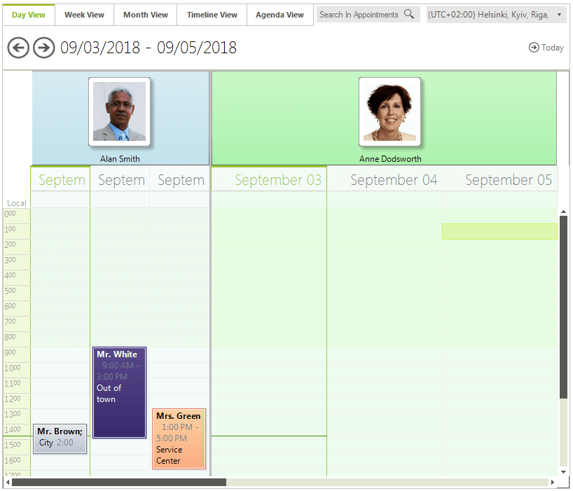
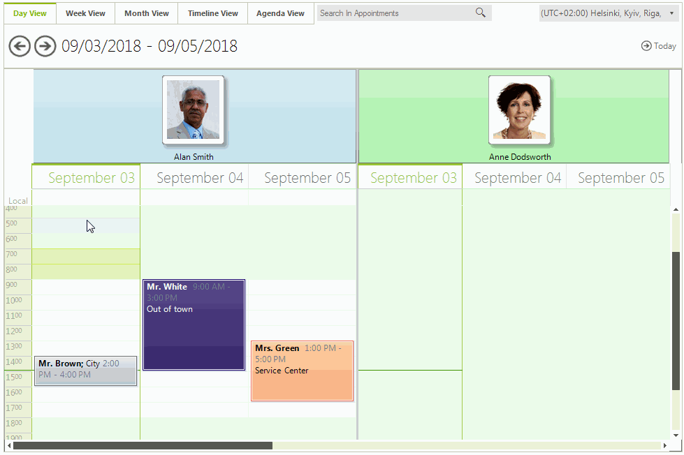
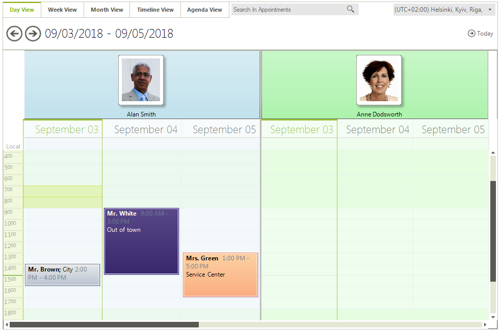
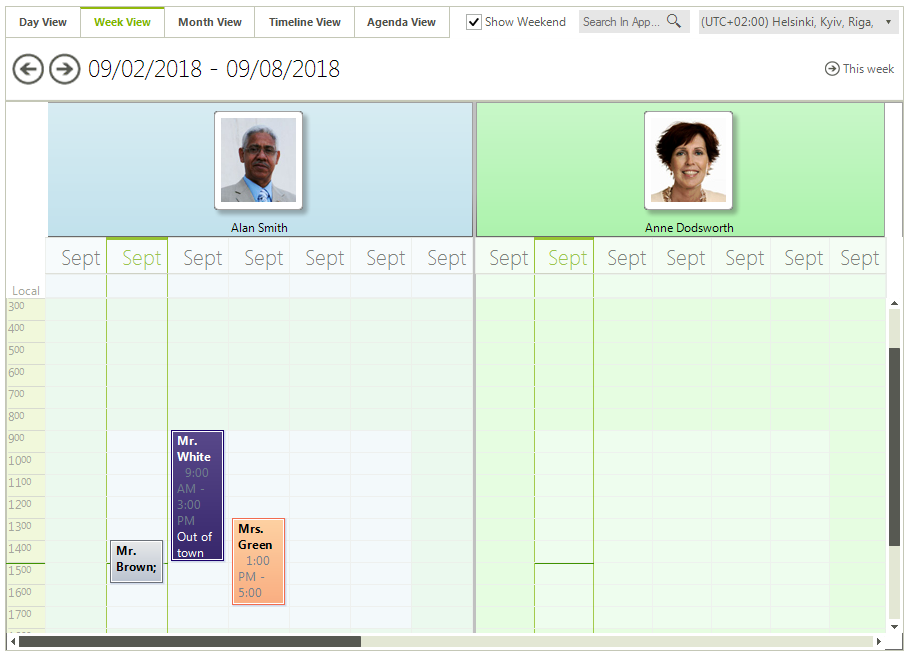
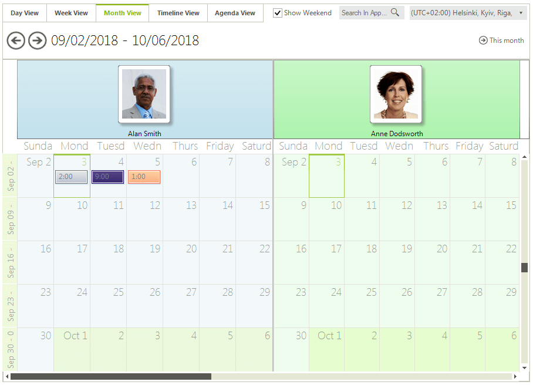
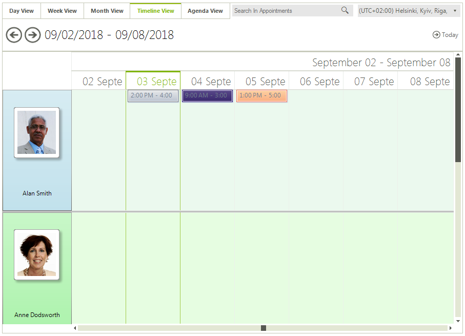
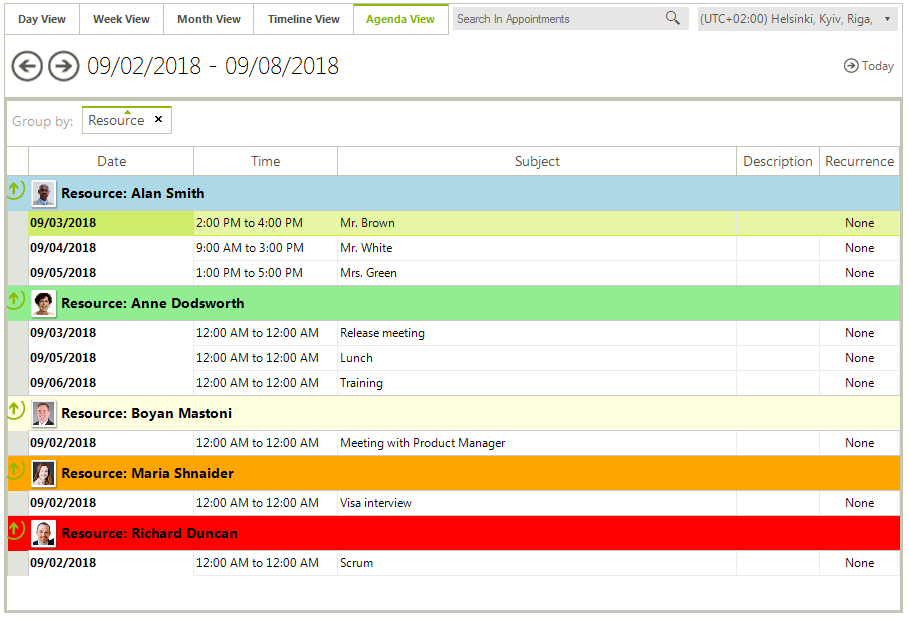

# Grouping by Resources

|RELATED VIDEOS|RELATED BLOGS|
|-----|-----|
|Resource Grouping in the RadSchedulerIn this webinar, Telerik Developer Support Specialist Robert Shoemate will introduce RadScheduler and demonstrate how to utilize its powerful feature set in your own applications. By attending this webinar, you will learn about features such as codeless data binding, adding custom fields, and UI customization.[(Runtime: 55:58)](http://www.telerik.com/videos/winforms/resource-grouping-in-the-radscheduler)|Telerik UI for WinForms R3 2009 - RadScheduler Resource Grouping R3 marks the release of some fantastic new features in the Telerik UI for WinForms. I know many of you have been waiting for one feature in particular... resource grouping. Well, I'm happy to say, the wait is over, resource grouping is here! Today, I am going to take some time out to explain to you how it works.[Read full post ...](http://blogs.telerik.com/RobertShoemate/Posts/09-11-05/radcontrols_for_winforms_q3_2009_-_radscheduler_resource_grouping.aspx)|

## Setting Up Grouping

The __RadScheduler__ control allows you to define custom resources that can be assigned to the appointments. Custom resources let you associate additional information with your appointments. Since custom resources have a limited number of values, RadScheduler can group appointments based on the resources associated with them. For example, you can book different facilities for a variety of events.

If you want to group RadScheduler by resources you can use the __GroupType__ property. It has two available values – None and Resources.

#### Group by Resources

<snippet id='scheduler-groupingbyresources-grouptype-cs' />
<snippet id='scheduler-groupingbyresources-grouptype-vb' />

You can add/remove resources using the RadScheduler’s Resources collection. The resources in __RadScheduler__ for Winforms are represented by the Resource class and you can assign it text, color and image values.

#### Resources Collection

<snippet id='scheduler-groupingbyresources-addingresources-cs' />
<snippet id='scheduler-groupingbyresources-addingresources-vb' />

## Setting the Number of Displayed Resources

You can use the view’s __ResourcesPerView__ property to change the number of visible resources.

#### Resources Count

<snippet id='scheduler-groupingbyresources-getdayview-cs' />
<snippet id='scheduler-groupingbyresources-getdayview-vb' />

## Navigating Through Resources

Navigating through resources To navigate to a specific resource you can use the __ResourceStartIndex__ property. To access it, you first need to cast the ViewElement to the base type for all grouped views – __SchedulerViewGroupedByResourceElementBase__.

#### Resource Start Index

<snippet id='scheduler-groupingbyresources-resourcenavigation-cs' />
<snippet id='scheduler-groupingbyresources-resourcenavigation-vb' />

To track when the resource index is changed, you can use the ResourceStartIndexChanging and ResourceStartIndexChanged events. The first one is fired before the index is actually changed and allows you to cancel the action. The second one is fired when the index has changed and the view was updated.

#### Track Index Changes

<snippet id='scheduler-groupingbyresources-resourcenavigationevents-cs' />
<snippet id='scheduler-groupingbyresources-resourcenavigationevents-vb' />

#### Handle Events

<snippet id='scheduler-groupingbyresources-resourcenavigationhandlers-cs' />
<snippet id='scheduler-groupingbyresources-resourcenavigationhandlers-vb' />

## Setting a Header Width

Depending on the currentlty active view the __SchedulerViewElement__ exposes a __ResourceHeaderHeight__ or __ResourceHeaderWidth__  properties which define the height or width of the header. A suitable place to listen to set these properties is the handler of the RadScheduler.__ActiveViewChanged__ event.

<snippet id='scheduler-groupingbyresources-setresourceheader-cs' />
<snippet id='scheduler-groupingbyresources-setresourceheader-vb' />

## Modifying the Size of the Resources

__RadScheduler__ allows you to specify different size for the different resources. To manipulate the size of the resources, you can use the SetResourceSize and GetResourceSize methods. The values passed to the SetResourceSize method are proportional and the actual size of the resources is calculated based on them. By default all resources have a value of 1 and therefore if you set a value of 2 to any resource, it will stay twice as bigger compared to the others.

#### Define Resource Size

<snippet id='scheduler-groupingbyresources-resourceresizing-cs' />
<snippet id='scheduler-groupingbyresources-resourceresizing-vb' />

>caption Figure 1: Resource Size

>note By default, the ActiveView.**GroupSeparatorWidth** property is set to 3. If you need to remove the resources separator, it is necessary to set the GroupSeparatorWidth property to 0.

## Accessing Child Elements

When grouped by resources the type of the RadScheduler.__ViewElement__ is a descendant of the __SchedulerViewGroupedByResourceElement__ class. This element is built of descendants of the base __SchedulerViewElement__ class and their count is determined by the count of the resources per view. The exact type of the child __SchedulerViewElement__ instances is determined by state of the currently chosen __SchedulerViewType__.

>note Each of the child __SchedulerViewElement__ objects has a single associated resource when the control is grouped by resources.

The example below demonstrates how each of the child view elements can be accessed, and has its own settings for a particular resource.

>caption Figure 2: SchedulerViewElement Settings 

#### Customize Child Views

<snippet id='scheduler-groupingbyresources-customizechildviewelements-cs' />
<snippet id='scheduler-groupingbyresources-customizechildviewelements-vb' />

>note Due to the UI virtualization the logic for accessing a particular view element associated with a resource needs to reapplied when the current resource or selected view type changes. This can be performed in the handlers of the __ActiveViewChanged__ and __ResourceStartIndexChanged__ events.

## Grouping By Resources In Different Views

>caption Figure 3: Day View

>caption Figure 4: Week View

>caption Figure 5: Month View

>caption Figure 6: Timeline View

>caption Figure 7: Agenda View

# See Also

* [Common Visual Properties]()
* [Working with Views]()
* [Views Walkthrough]()
* [Grouping by Resources]()
* [Exact Time Rendering]()
