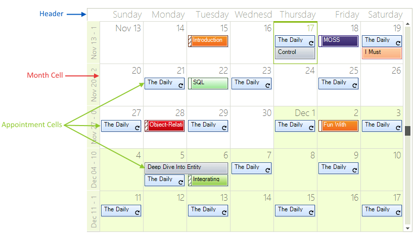
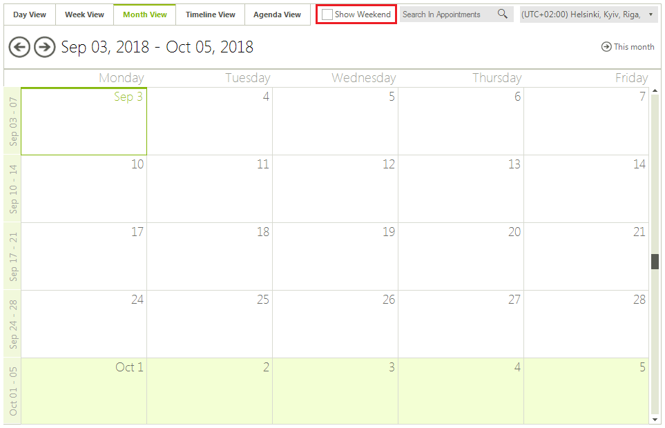
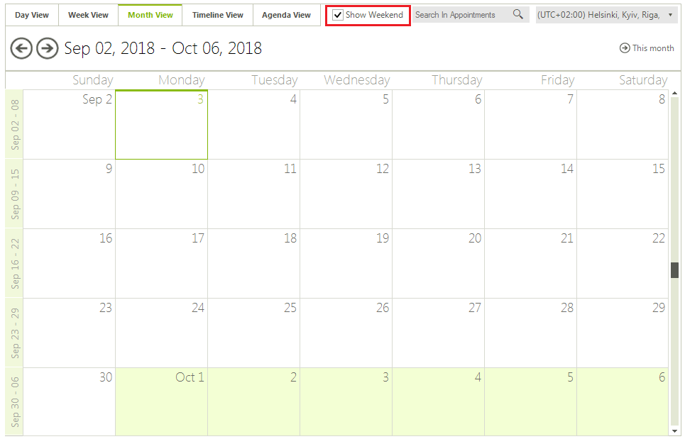
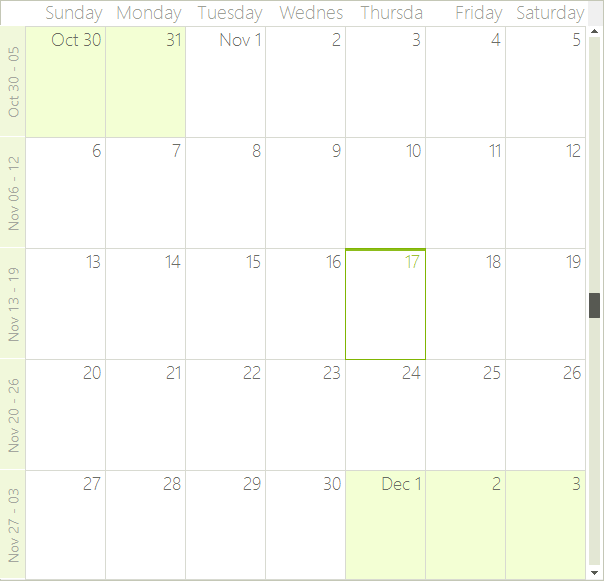
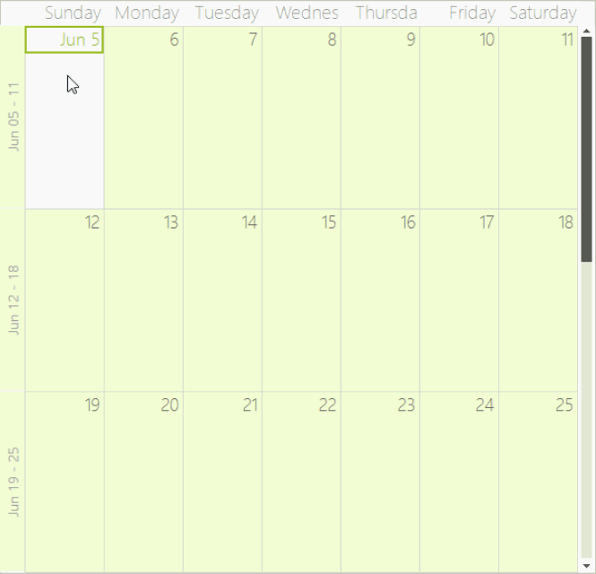
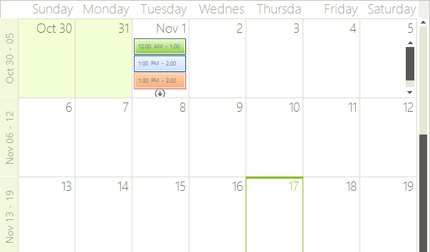
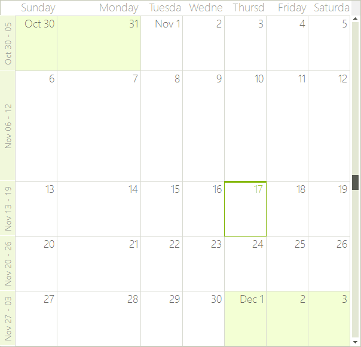
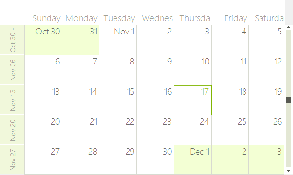

# Month View

## Month View Overview

The Month view shows one month at a time, or a preset number of weeks. To move to the next day or previous month, you can use the back and forward keyboard arrows, or the [SchedulerNavigator]() control.

## Structure of Month View

The [Month View]() of the scheduler simply has a __Header__, __Month Cells__ for every day in the month and zero or more __Appointment Cells__ in each month cell.

>caption Figure 1: Month View



## Set the Month View

The Week View can be set it to be the default view which the user sees:

#### ActiveViewType Property

{{source=..\SamplesCS\Scheduler\Views\MonthView.cs region=activeViewType}} 
{{source=..\SamplesVB\Scheduler\Views\MonthView.vb region=activeViewType}} 

````C#
this.radScheduler1.ActiveViewType = Telerik.WinControls.UI.SchedulerViewType.Month;

````
````VB.NET
Me.RadScheduler1.ActiveViewType = Telerik.WinControls.UI.SchedulerViewType.Month

````

{{endregion}} 

## Get  Month View

To get the instance to the SchedulerMonthView from the RadScheduler object:

* use the __GetMonthView__ method:

#### GetMonthView Method

{{source=..\SamplesCS\Scheduler\Views\MonthView.cs region=getMonthView}} 
{{source=..\SamplesVB\Scheduler\Views\MonthView.vb region=getMonthView}} 

````C#
            
SchedulerMonthView monthView = this.radScheduler1.GetMonthView();

````
````VB.NET
Dim monthView As SchedulerMonthView = Me.RadScheduler1.GetMonthView()

````

{{endregion}} 

## Showing/Hiding The Weekend

By default the weekends are shown, but you can hide them by using the __ShowWeekend__ property:

#### Show Weekend

{{source=..\SamplesCS\Scheduler\Views\MonthView.cs region=showWeekend}} 
{{source=..\SamplesVB\Scheduler\Views\MonthView.vb region=showWeekend}} 

````C#
monthView.ShowWeekend = true;

````
````VB.NET
monthView.ShowWeekend = False

````

{{endregion}} 

You can also specify which days to be considered weekends. The WorkWeekStart and WorkWeekEnd properties allow you to achieve this:

#### Set Work Week Start

{{source=..\SamplesCS\Scheduler\Views\MonthView.cs region=workWeek}} 
{{source=..\SamplesVB\Scheduler\Views\MonthView.vb region=workWeek}} 

````C#
monthView.WorkWeekStart = DayOfWeek.Tuesday;
monthView.WorkWeekEnd = DayOfWeek.Thursday;

````
````VB.NET
monthView.WorkWeekStart = DayOfWeek.Tuesday
monthView.WorkWeekEnd = DayOfWeek.Thursday

````

{{endregion}} 

## Change The Start/End Work Days 

The work days determine the start and end days for the work week. All days outside the work days range are part of the weekend.

#### Start/End Work Days

{{source=..\SamplesCS\Scheduler\Views\MonthView.cs region=workDays}} 
{{source=..\SamplesVB\Scheduler\Views\MonthView.vb region=workDays}} 

````C#
monthView.WorkWeekStart = DayOfWeek.Wednesday;
monthView.WorkWeekEnd = DayOfWeek.Saturday;

````
````VB.NET
monthView.WorkWeekStart = DayOfWeek.Wednesday
monthView.WorkWeekEnd = DayOfWeek.Saturday

````

{{endregion}} 

>caption Figure 2: Shown Weekends




## Setting The Number Of Weeks

By default the Month view shows 3 weeks at a time, but this can be changed by using the __WeekCount__ property (the minimum value is 1 week): 

#### Set Number of Weeks

{{source=..\SamplesCS\Scheduler\Views\MonthView.cs region=weekCount}} 
{{source=..\SamplesVB\Scheduler\Views\MonthView.vb region=weekCount}} 

````C#
monthView.WeekCount = 5;

````
````VB.NET
monthView.WeekCount = 5

````

{{endregion}} 


## Getting The Week Days Displayed

#### Get Week Days

{{source=..\SamplesCS\Scheduler\Views\MonthView.cs region=weekDaysCount}} 
{{source=..\SamplesVB\Scheduler\Views\MonthView.vb region=weekDaysCount}} 

````C#
int weekDaysCount = monthView.WeekDaysCount;

````
````VB.NET
Dim weekDaysCount As Integer = monthView.WeekDaysCount

````

{{endregion}} 

## Showing Full Month

It is possible to indicate whether the month view should always display exactly one month with the respective number of weeks.

#### Full Month

{{source=..\SamplesCS\Scheduler\Views\MonthView.cs region=showFullMonth}} 
{{source=..\SamplesVB\Scheduler\Views\MonthView.vb region=showFullMonth}} 

````C#
monthView.ShowFullMonth = true;

````
````VB.NET
monthView.ShowFullMonth = True

````

{{endregion}} 

>caption Figure 3: Show Full Month


## Showing/Hiding The Vertical Navigator

#### Hiding The Vertical Indicator

{{source=..\SamplesCS\Scheduler\Views\MonthView.cs region=showVerticalNavigator}} 
{{source=..\SamplesVB\Scheduler\Views\MonthView.vb region=showVerticalNavigator}} 

````C#
monthView.ShowVerticalNavigator = false;

````
````VB.NET
monthView.ShowVerticalNavigator = False

````

{{endregion}} 

## Setting The Vertical Navigator Range

#### Navigator Range

{{source=..\SamplesCS\Scheduler\Views\MonthView.cs region=verticalNavigatorRange}} 
{{source=..\SamplesVB\Scheduler\Views\MonthView.vb region=verticalNavigatorRange}} 

````C#
monthView.RangeStartDate = new DateTime(2016, 6, 10);
monthView.RangeEndDate = new DateTime(2016, 7, 20);

````
````VB.NET
monthView.RangeStartDate = New DateTime(2016, 6, 10)
monthView.RangeEndDate = New DateTime(2016, 7, 20)

````

{{endregion}} 

>caption Figure 4: Navigator Range


## Showing And Hiding The Week (Row) Headers

The week (row) headers display the date range presented by the respective row. By clicking on them, the user can navigate to WeekView with the specified range. Showing/hiding the week (row) headers is done through the __ShowWeeksHeader__ property (the default setting is True). To allow or disallow navigating to __WeekView__ on click, you can set the __EnableWeeksHeader__ property (which also defaults to True)

#### Showing Weeks Headers

{{source=..\SamplesCS\Scheduler\Views\MonthView.cs region=showWeeksHeader}} 
{{source=..\SamplesVB\Scheduler\Views\MonthView.vb region=showWeeksHeader}} 

````C#
monthView.ShowWeeksHeader = true;
monthView.EnableWeeksHeader = false;

````
````VB.NET
monthView.ShowWeeksHeader = True
monthView.EnableWeeksHeader = True

````

{{endregion}} 

## Customizing The Week (Row) Header Format

RadScheduler uses the [.NET Standard DateTime Format Strings](http://msdn.microsoft.com/en-us/library/az4se3k1(VS.71).aspx), which can be set through the HeaderFormat property (either in design time or through code). The default value is "MMMM dd":

#### Setting A Header Format

{{source=..\SamplesCS\Scheduler\Views\MonthView.cs region=headerFormat}} 
{{source=..\SamplesVB\Scheduler\Views\MonthView.vb region=headerFormat}} 

````C#
radScheduler1.HeaderFormat = "MMMM dd";

````
````VB.NET
RadScheduler1.HeaderFormat = "MMMM dd"

````

{{endregion}}

## Showing An Exact Month

You can set the __ShowFullMonth__ property to force the __SchedulerMonthView__ to always display exactly one month no matter how many weeks it contains. When this property is enabled, the view will always navigate to the beginning of the previous/next month and the WeekCount will automatically be updated according to the number of weeks in the target month.

#### Full Month

{{source=..\SamplesCS\Scheduler\Views\MonthView.cs region=showFullMonth}} 
{{source=..\SamplesVB\Scheduler\Views\MonthView.vb region=showFullMonth}} 

````C#
monthView.ShowFullMonth = true;

````
````VB.NET
monthView.ShowFullMonth = True

````

{{endregion}} 

## Vertical Scrolling

The vertical scrollbar in __MonthView__ allows for quick navigation in large date ranges.  To show or hide the vertical scrollbar you can use the __ShowVerticalNavigator__ property. When the vertical scrollbar is displayed it can navigate through the date range defined by the __RangeStartDate__ and __RangeEndDate__ properties. These properties do not limit keyboard navigation outside this range but only stand for specifying the range of the vertical scrollbar.

#### Verical Scrolling Range

{{source=..\SamplesCS\Scheduler\Views\MonthView.cs region=verticalScrolling}} 
{{source=..\SamplesVB\Scheduler\Views\MonthView.vb region=verticalScrolling}} 

````C#
monthView.ShowVerticalNavigator = true;
monthView.RangeStartDate = DateTime.Today.AddYears(-1);
monthView.RangeEndDate = DateTime.Today.AddYears(1);

````
````VB.NET
monthView.ShowVerticalNavigator = True
monthView.RangeStartDate = DateTime.Today.AddYears(-1)
monthView.RangeEndDate = DateTime.Today.AddYears(1)

````

{{endregion}} 

## Handling Overflown Cells

RadScheduler handles the overflown cells in month view in two ways. The first one is by displaying a cell overflow button at the bottom of each cell that has more appointments than it can display. Clicking on this button opens a DayView set to the same date the cell represents. This way the user can scroll through and preview all appointments. The second way to handle overflown cells is by displaying a scrollbar at the end of each row if this row contains overflown cells. Using the scrollbar the end user can scroll directly through the appointments. Both of these features can be disabled or enabled using the following properties:

#### Appointments Scrolling

{{source=..\SamplesCS\Scheduler\Views\MonthView.cs region=overflow}} 
{{source=..\SamplesVB\Scheduler\Views\MonthView.vb region=overflow}} 

````C#
monthView.EnableCellOverflowButton = true;
monthView.EnableAppointmentsScrolling = true;

````
````VB.NET
monthView.EnableCellOverflowButton = True
monthView.EnableAppointmentsScrolling = True

````

{{endregion}} 

>caption Figure 5: Appointments Scrolling


## Modifying The Size Of Rows And Columns In MonthView

The __SchedulerMonthViewElement__ allows you to specify different size for the different columns. To manipulate the size of the columns, you can use the __SetColumnWidth__, __GetColumnWidth__, __SetRowHeight__, __GetRowHeight__ methods. The values passed to the SetColumnWidth and SetRowHeight methods are proportional and the actual width of the columns is calculated based on them. By default all columns have a value of 1 and therefore if you set a value of 2 to any column, it will stay twice as bigger compared to the others.

#### Setting Row Height

{{source=..\SamplesCS\Scheduler\Views\MonthView.cs region=columnRowResize}} 
{{source=..\SamplesVB\Scheduler\Views\MonthView.vb region=columnRowResize}} 

````C#
SchedulerMonthViewElement monthViewElement = (SchedulerMonthViewElement)this.radScheduler1.ViewElement;
monthViewElement.SetRowHeight(1, 2);
monthViewElement.SetColumnWidth(1, 2);

````
````VB.NET
Dim monthViewElement As SchedulerMonthViewElement = DirectCast(Me.RadScheduler1.ViewElement, SchedulerMonthViewElement)
monthViewElement.SetRowHeight(1, 2)
monthViewElement.SetColumnWidth(1, 2)

````

{{endregion}} 

>caption Figure 6: Row Height


## Modifying The Size Of The Headers In MonthView

The month view of RadScheduler contains two headers – the horizontal __MonthViewHeader__, which displays the weekdays on top of the columns, and the vertical __MonthViewVerticalHeader__, which displays the date ranges for each row. You can modify the size of these headers by accessing the respective element and its properties:

#### Headers Size

{{source=..\SamplesCS\Scheduler\Views\MonthView.cs region=headerResize}} 
{{source=..\SamplesVB\Scheduler\Views\MonthView.vb region=headerResize}} 

````C#
monthViewElement.VerticalHeader.HeaderWidth = 50;
monthViewElement.Header.HeaderHeight = 50;

````
````VB.NET
monthViewElement.VerticalHeader.HeaderWidth = 50
monthViewElement.Header.HeaderHeight = 50

````

{{endregion}} 

>caption Figure 7: Headers Size


# See Also

* [Common Visual Properties]()
* [Working with Views]()
* [Views Walkthrough]()
* [Grouping by Resources]()
* [Exact Time Rendering]()
