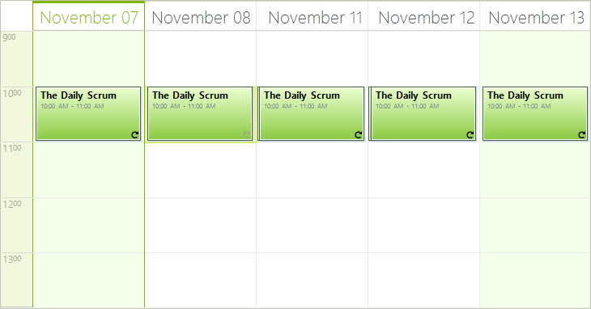

# MultiDay View

## Overview

__MultidayView__ shows multiple date-time intervals with appointments arranged one next to another. In the screenshot below we have __MultidayView__ with two intervals – the first one starts from November 07 with duration of two days and the second on starts from November 11 with duration of 3 days.

>caption Figure 1: Multi Day View

## Using MultidayView

1\. In order to set the current view of __RadScheduler__ to __MultidayView__, use the __ActiveViewType__ or __ActiveView__ properties:

<snippet id='scheduler-multidayview-multiday-cs' />
<snippet id='scheduler-multidayview-multiday-vb' />

2\. To add, remove or modify a date-time __Interval__ in SchedulerMultiDayView instance use the __Intervals__ collection.

3\. To get all appointments in a particular interval, use the __GetAppointmentsInInterval__ helper method:

<snippet id='scheduler-multidayview-interval-cs' />
<snippet id='scheduler-multidayview-interval-vb' />

4\. To get all appointments in the view, use the __Appointments__ collection.

>note  __SchedulerMultiDayView__ inherits the rest of its properties from the base __SchedulerDayView__ and therefore you can refer to the [Day View]() article for additional options.
>

# See Also

* [Common Visual Properties]()
* [Working with Views]()
* [Views Walkthrough]()
* [Grouping by Resources]()
* [Exact Time Rendering]()
