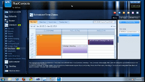
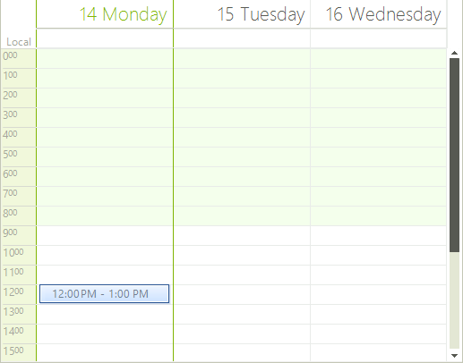
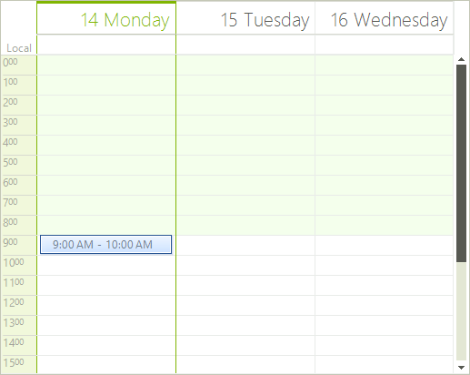
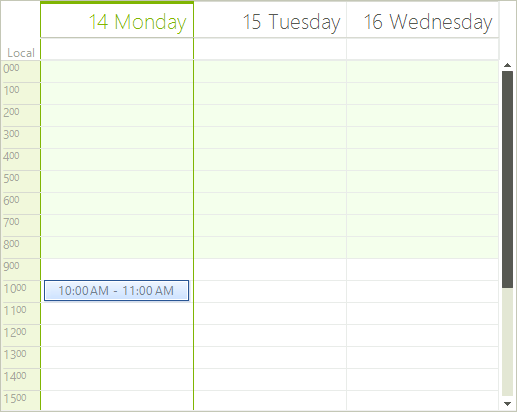
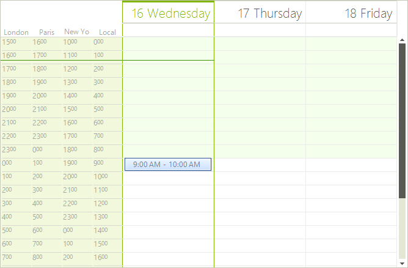
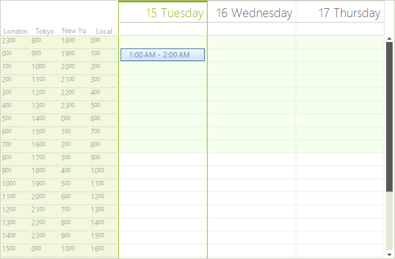
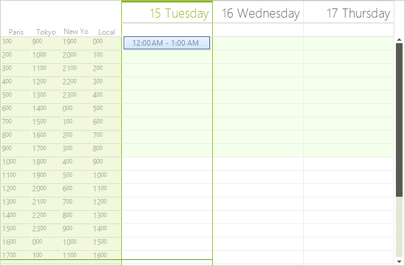
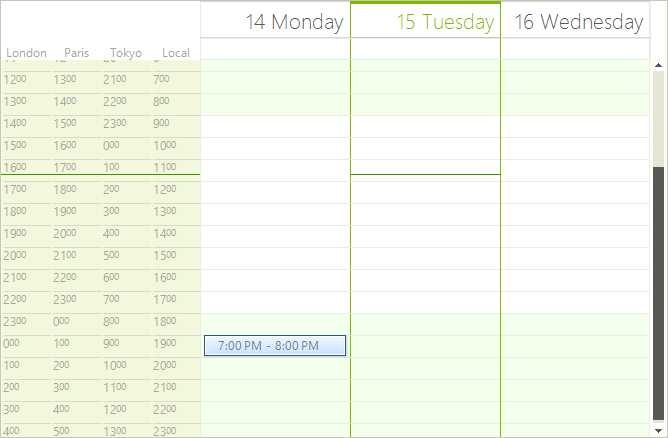

# Time Zones

| RELATED VIDEOS |  |
| ------ | ------ |
|[Using Time Zones in RadScheduler for WinForms](http://www.telerik.com/videos/winforms/using-time-zones-in-radscheduler-for-winforms) In this video, you will learn how to display appointments contained in RadScheduler in different time zones. You will also learn how to add time zone rulers to RadScheduler.||

The Time Zones feature of __RadScheduler__ allows the user to see a ruler representing an hour scale set according to a time zone different than the local time zone. In addition, the user can see not just one time ruler, but several rulers for several time zones at once. Two important properties determine the behavior of the Time Zones feature: SystemTimeZone and DefaultTimeZone.

### SchedulerTimeZone and TimeZoneInformation Objects
          
All properties that are related to the time zones use the SchedulerTimeZone class. This class contains the TimeZoneInformaion object and a Label. TimeZoneInformation object contains all the information for the time zone (name, bias, etc.). We are using a Label to  show the titles of the time zones in day view based views.            

We provide an easy way to take all time zones from the Windows. To do this, you should call the static method GetTimeZones of the Time class. The method will return a TimeZoneCollection object which contains all TimeZoneInformation objects. In addition, you could get all SchedulerTimeZone objects by calling the method GetSchedulerTimeZones of the SchedulerTimeZone:

#### Get Time Zones

<snippet id='scheduler-timeszones-getallzones-cs' />
<snippet id='scheduler-timeszones-getallzones-vb' />

>note The *bias* property represents the difference between the "UTC" time zone and the time zone that you want to set to RadScheduler in minutes multiplied by minus 1. For example, if the time zone that you want to set is "(UTC -05:00) Eastern Time (US and Canada)" the *bias* value would be -5 * 60 * -1 = 300
>

### SystemTimeZone Property

All appointments in RadScheduler are stored/loaded according to the value of the SystemTimeZone. The user is able to change the time zone representation of the logical appointments by setting this property. The default value of the property is the local time zone of the computer where RadScheduler is started.
            
1\. Let's create an appointment from 10:00 AM to 11:00 AM:

<snippet id='scheduler-timeszones-creatingappointment-cs' />
<snippet id='scheduler-timeszones-creatingappointment-vb' />

By default, this appointment will be shown from 10:00 AM to 11:00 AM:

>caption Figure 1: Default SystemTimeZone

2\. Let's now set the SystemTimeZone property to "UTC" time zone:

<snippet id='scheduler-timeszones-systemtimezone-cs' />
<snippet id='scheduler-timeszones-systemtimezone-vb' />

This will change the representation of the appointment according to the time zone set to the client machine. Please note that the start time, end time and duration of the logical appointment are not changed. Only the representation of the appointment in the active view is changed. For example, if we start the RadScheduler on a client machine where the time zone is "UTC + 02:00", our appointment will look as shown on the screenshot below:

>caption Figure 2: UTC SystemTimeZone

This is a normal behavior, because when it is ten o'clock at the "UTC" time zone, locally ("UTC +02:00") it is twelve o'clock.

### DefaultTimeZone property
          
All __RadScheduler__ views have the __DefaultTimeZone__ property. The active view of the __RadScheduler__ represents all appointment elements in the default time zone calculated according to the SystemTimeZone. The default value of the property is the local time zone of the computer where RadScheduler is started.            

1\. Let's create an appointment from 10:00 AM to 11:00 AM:

<snippet id='scheduler-timeszones-creatingappointment-cs' />
<snippet id='scheduler-timeszones-creatingappointment-vb' />

By default, this appointment will be shown from 10:00 AM to 11:00 AM:

>caption Figure 3: Default Time Zone                

2\. Let's now set the DefaultTimeZone property of the ActiveDayView to "UTC + 1" time zone:

<snippet id='scheduler-timeszones-defaulttimezone-cs' />
<snippet id='scheduler-timeszones-defaulttimezone-vb' />

Again, this will change the representation of the appointment according to the time zone of the client machine. However, this time the appointment will be represented according to the time scale of the "UTC + 1" time zone. Since we are running the RadScheduler instance on a machine where the time zone set is "UTC + 2", an appointment starting at 10 o'clock will be represented as an appointment starting at 9:

>caption Figure 4: UTC Default Time Zone    

### Combining SystemTimeZone with DefaultTimeZone
          
The combination of using both SystemTimeZone and DefaultTimeZone will result in the following representation:

### TimeZones
          
All day view based views (Day view, Week view, Work week view) have the property TimeZones. When you set the DefaultTimeZone property, it will change the time zone of the last item in the TimeZones collection making it the same as DefaultTimeZone. All day view based views create rulers for each time zone in the TimeZones collection. The default time zone is the rightmost ruler in the view. This ruler takes the last time zone from the TimeZones collection.

### Real world scenario
          
Imagine the following scenario: your application uses RadScheduler and it is run on different client machines at different points of the world, hence different time zones. The users of this application create appointments and then store these appointments on a server. When somebody creates and stores an appointment on the server, we only know the start time of the appointment (let's say 10 o'clock), but there is no information about the time zone in which the appointment will take place at 10. For example, one saves an appointment in Tokyo at 10 o'clock and when this appointment is loaded in New York, it shows 10 local time again, which is incorrect.

The way to handle this situation is to choose one time zone as the system time zone for all client stations and when an appointment starts at 10, this means that it starts at 10 in a specific zone.

This functionality can be achieved by setting the SystemTimeZone of RadScheduler. Let's say that the default time zone is "(UTC) Dublin, Edinburgh, Lisbon, London". We can get the time zone from the Windows registry and set it as SystemTimeZone as shown below:

<snippet id='scheduler-timeszones-london-cs' />
<snippet id='scheduler-timeszones-london-vb' />

<snippet id='scheduler-timeszones-insertingtimezones-cs' />
<snippet id='scheduler-timeszones-insertingtimezones-vb' />

Further, we may want to show the four most commonly used time zones - Tokyo, New York, London and Paris. This can be achieved by getting the appropriate time zones from the Windows registry and adding them to RadScheduler:

<snippet id='scheduler-timeszones-insertingtimezones-cs' />
<snippet id='scheduler-timeszones-insertingtimezones-vb' />

It is important to Insert the zones, because this will make your local time zone the zone according to which the appointment will be represented. In addition, we should check if the DefaultTimeZone of RadScheduler(which is taken from the client machine where RadScheduler is started) is the equal to the time zone that we are going to insert. If this is so, we should not insert the zone, because we want to avoid having repetitive time zones.

Finally, set the RulerWidth property to an appropriate value to show the entire labels:

<snippet id='scheduler-timeszones-rulerwidth-cs' />
<snippet id='scheduler-timeszones-rulerwidth-vb' />

After all these steps are performed, let's try to create an appointment starting at 10 o'clock on Jan 12 on a client machine where the local time zone is "(UTC +09:00) Osaka, Sapporo, Tokyo". Here is how this appointment will look like on client machines having different local time zones set:

>caption Figure 1: RadScheduler started in Tokyo (or "(UTC +09:00) Osaka, Sapporo, Tokyo") 

>caption Figure 2: RadScheduler started in Paris (or "(UTC +01:00) Brussels, Copenhagen, Madrid, Paris")

>caption Figure 3: RadScheduler started in London (or "(UTC) Dublin, Edinburgh, Lisbon, London")

>caption Figure 4: RadScheduler started in New York (or "(UTC -04:00) Eastern Time (US and Canada)")

# See Also

* [Common Visual Properties]()
* [Working with Views]()
* [Views Walkthrough]()
* [Grouping by Resources]()
* [Exact Time Rendering]()
