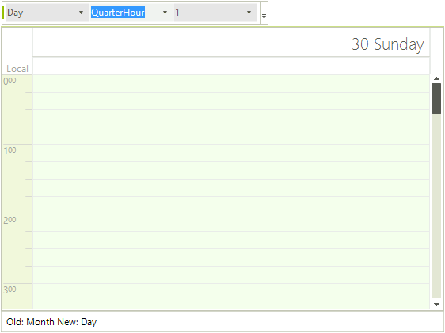

# Views Walkthrough

In this walkthrough (part of the [Telerik UI for WinForms Step-by-step Tutorial](http://www.telerik.com/support/documentation-and-tutorials/step-by-step-tutorial-for-winforms.aspx)) you will dynamically change the view, change some of the view specific properties and handle the __ActiveViewChanging__ event.

## Project Setup

1. Create a new Windows Forms application.

1. In the Solution Explorer, delete the default form.

1. Also in the Solution Explorer, right-click the project and select __Add | New Item...__ from the context menu.
            
1. Select the "Telerik RadForm" template and click the __Add__ button to close the dialog.

1. Add the __DesertTheme__ from the ToolBox to the form.

1. In the Properties window, set the form __ThemeName__ to __Desert__.

1. Add a __RadStatusStrip__ to the form. Set the __ThemeName__ to __Desert__. Add a RadLabelElement to the status strip. Set the __Name__ property to "lblStatus" and the __Text__ to "".     

1. Add a RadCommandBar to the form. Add elements to the bar:
    - Add a __RadCommandBarDropDownList__. Set the  __Name__ to "ddlActiveViewType" and __Text__ to "".
    - Add a __RadCommandBarDropDownList__. Set the __Name__ to "ddlRange" and __Text__ to "".
    - Add a __RadCommandBarDropDownList__. Set the __Name__ to "ddlACount" and __Text__ to "".              
1. Change the new RadForm1 to be the startup form.

1. From the Toolbox, add a __RadScheduler__ to the form and set the __Dock__ property to "Fill" and the __ThemeName__ to __Desert__.

1. Add code to the form load that will add values to the combo boxes in the tool strip for __SchedulerViewType__ and __ScaleRange__ enumerations. Also, add a simple range of integers to the "count" combo box.

<snippet id='scheduler-viewswalkthrough-addingvalues-cs' />
<snippet id='scheduler-viewswalkthrough-addingvalues-vb' />

12\. Next add a SelectedIndexChanged event handler for the ddlActiveViewType combo box:

<snippet id='scheduler-viewswalkthrough-selectedindexchanged-cs' />
<snippet id='scheduler-viewswalkthrough-selectedindexchanged-vb' />

13\. Add another SelectedIndexChanged event handler for the ddlRange combo box element:

<snippet id='scheduler-viewswalkthrough-rangechanged-cs' />
<snippet id='scheduler-viewswalkthrough-rangechanged-vb' />

14\. Add another SelectedIndexChanged event handler for the ddlCount combo box element:

<snippet id='scheduler-viewswalkthrough-countchanged-cs' />
<snippet id='scheduler-viewswalkthrough-countchanged-vb' />

15\. Handle the RadScheduler ActiveViewChanging event. Use the SchedulerViewChangingEventArgs OldView and NewView to display in the status label.

<snippet id='scheduler-viewswalkthrough-activeviewchanging-cs' />
<snippet id='scheduler-viewswalkthrough-activeviewchanging-vb' />

16\. Run the application and test the various combinations of settings.

>caption Figure 1: Views Walkthrough

# See Also

* [Common Visual Properties]()
* [Working with Views]()
* [Grouping by Resources]()
* [Exact Time Rendering]()
