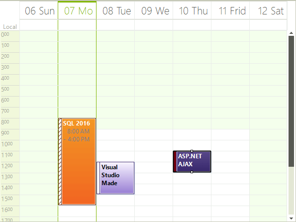

# Week View

## Overview

The Week view by default shows a full seven-day week week at a time, which can be set to start at a predefined day (say Monday, or Sunday). To move to the next or previous week, you can use the back and forward keyboard arrows, or the [SchedulerNavigator]() control, which also allows you to control whether to show weekends or not.

>caption Figure 1: Week View


## Set Week View

To explicitly set the Work Week to be the default view which the user sees on the form:

#### Set ActiveViewType

{{source=..\SamplesCS\Scheduler\Views\WeekView.cs region=ViewType}} 
{{source=..\SamplesVB\Scheduler\Views\WeekView.vb region=ViewType}} 

````C#
this.radScheduler1.ActiveViewType = SchedulerViewType.Week;

````
````VB.NET
Me.RadScheduler1.ActiveViewType = SchedulerViewType.Week

````

{{endregion}} 

## Get Week View

To get the instance to the SchedulerWeek view from the RadScheduler object, either:

* use the __GetWeekView__ method:

#### GetWeekView Method

{{source=..\SamplesCS\Scheduler\Views\WeekView.cs region=weekView}} 
{{source=..\SamplesVB\Scheduler\Views\WeekView.vb region=weekView}} 

````C#
SchedulerWeekView weekView = this.radScheduler1.GetWeekView();

````
````VB.NET
Dim weekView As SchedulerWeekView = Me.RadScheduler1.GetWeekView()

````

{{endregion}} 

>note This method returns null if the active view of the scheduler is not SchedulerWeekView.
>

* use the RadScheduler __ActiveView__ property:             

#### ActiveView Property

{{source=..\SamplesCS\Scheduler\Views\WeekView.cs region=activeView}} 
{{source=..\SamplesVB\Scheduler\Views\WeekView.vb region=activeView}} 

````C#
if (this.radScheduler1.ActiveViewType == SchedulerViewType.Week)
{
    SchedulerWeekView activeWeekView = (SchedulerWeekView)this.radScheduler1.ActiveView;
}

````
````VB.NET
If Me.RadScheduler1.ActiveViewType = SchedulerViewType.Week Then
    Dim activeWeekView As SchedulerWeekView = CType(Me.RadScheduler1.ActiveView, SchedulerWeekView)
End If

````

{{endregion}} 

## Showing/Hiding The Weekend

By default the weekends are shown, but you can hide them by using the __ShowWeekend__ property:

#### Show Weekend

{{source=..\SamplesCS\Scheduler\Views\WeekView.cs region=Weekend}} 
{{source=..\SamplesVB\Scheduler\Views\WeekView.vb region=Weekend}} 
````C#
weekView.ShowWeekend = false;

````
````VB.NET
weekView.ShowWeekend = False

````

{{endregion}} 

# See Also

* [Common Visual Properties]()
* [Working with Views]()
* [Views Walkthrough]()
* [Grouping by Resources]()
* [Exact Time Rendering]()
