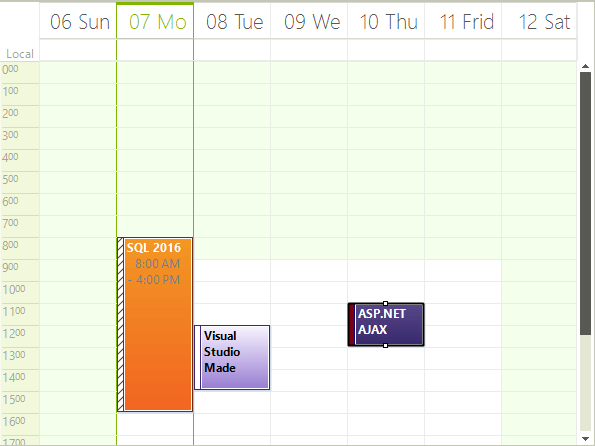

# Week View

## Overview

The Week view by default shows a full seven-day week week at a time, which can be set to start at a predefined day (say Monday, or Sunday). To move to the next or previous week, you can use the back and forward keyboard arrows, or the [SchedulerNavigator]() control, which also allows you to control whether to show weekends or not.

>caption Figure 1: Week View

## Set Week View

To explicitly set the Work Week to be the default view which the user sees on the form:

#### Set ActiveViewType

<snippet id='scheduler-weekview-viewtype-cs' />
<snippet id='scheduler-weekview-viewtype-vb' />

## Get Week View

To get the instance to the SchedulerWeek view from the RadScheduler object, either:

* use the __GetWeekView__ method:

#### GetWeekView Method

<snippet id='scheduler-weekview-weekview-cs' />
<snippet id='scheduler-weekview-weekview-vb' />

>note This method returns null if the active view of the scheduler is not SchedulerWeekView.
>

* use the RadScheduler __ActiveView__ property:             

#### ActiveView Property

<snippet id='scheduler-weekview-activeview-cs' />
<snippet id='scheduler-weekview-activeview-vb' />

## Showing/Hiding The Weekend

By default the weekends are shown, but you can hide them by using the __ShowWeekend__ property:

#### Show Weekend

<snippet id='scheduler-weekview-weekend-cs' />
<snippet id='scheduler-weekview-weekend-vb' />

# See Also

* [Common Visual Properties]()
* [Working with Views]()
* [Views Walkthrough]()
* [Grouping by Resources]()
* [Exact Time Rendering]()
