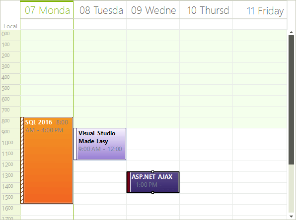

# Work Week View

## Overview

The Work Week View is a special case of the WeekView, where the __ShowWeekend__ property is by default set to __false__.

>caption Figure 1: Work Week View


## Set the Work Week View

The Week View can be set it to be the default view which the user sees:

#### ActiveViewType Property

{{source=..\SamplesCS\Scheduler\Views\WorkWeekView.cs region=activeViewType}} 
{{source=..\SamplesVB\Scheduler\Views\WorkWeekView.vb region=activeViewType}} 

````C#
this.radScheduler1.ActiveViewType = Telerik.WinControls.UI.SchedulerViewType.WorkWeek;

````
````VB.NET
Me.RadScheduler1.ActiveViewType = Telerik.WinControls.UI.SchedulerViewType.WorkWeek

````

{{endregion}} 

## Get Work Week View

To get the instance to the SchedulerWeekView from the RadScheduler object,either:

* use the __GetWeekView__ method:

#### GetWeekView Method

{{source=..\SamplesCS\Scheduler\Views\WorkWeekView.cs region=getWeekView}} 
{{source=..\SamplesVB\Scheduler\Views\WorkWeekView.vb region=getWeekView}}
````C#
SchedulerWeekView weekView = this.radScheduler1.GetWeekView();

````
````VB.NET
Dim weekView As SchedulerWeekView = Me.RadScheduler1.GetWeekView()

```` 

{{endregion}} 

>note This method returns null if the active view of the scheduler is not SchedulerWeekView.
>

* use the the RadScheduler __ActiveView__ property:

#### ActiveView Property

{{source=..\SamplesCS\Scheduler\Views\WorkWeekView.cs region=activeWorkWeek}} 
{{source=..\SamplesVB\Scheduler\Views\WorkWeekView.vb region=activeWorkWeek}}
````C#
if (this.radScheduler1.ActiveViewType == SchedulerViewType.WorkWeek)
{
    SchedulerWeekView activeWeekView = (SchedulerWeekView)this.radScheduler1.ActiveView;
}

````
````VB.NET
If Me.RadScheduler1.ActiveViewType = SchedulerViewType.WorkWeek Then
    Dim activeWeekView As SchedulerWeekView = CType(Me.RadScheduler1.ActiveView, SchedulerWeekView)
End If

```` 


{{endregion}}

# See Also

* [Common Visual Properties]()
* [Working with Views]()
* [Views Walkthrough]()
* [Grouping by Resources]()
* [Exact Time Rendering]()
