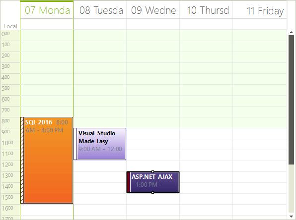

# Work Week View

## Overview

The Work Week View is a special case of the WeekView, where the __ShowWeekend__ property is by default set to __false__.

>caption Figure 1: Work Week View

## Set the Work Week View

The Week View can be set it to be the default view which the user sees:

#### ActiveViewType Property

<snippet id='scheduler-workweekview-activeviewtype-cs' />
<snippet id='scheduler-workweekview-activeviewtype-vb' />

## Get Work Week View

To get the instance to the SchedulerWeekView from the RadScheduler object,either:

* use the __GetWeekView__ method:

#### GetWeekView Method

<snippet id='scheduler-workweekview-getweekview-cs' />
<snippet id='scheduler-workweekview-getweekview-vb' />

>note This method returns null if the active view of the scheduler is not SchedulerWeekView.
>

* use the the RadScheduler __ActiveView__ property:

#### ActiveView Property

<snippet id='scheduler-workweekview-activeworkweek-cs' />
<snippet id='scheduler-workweekview-activeworkweek-vb' />

# See Also

* [Common Visual Properties]()
* [Working with Views]()
* [Views Walkthrough]()
* [Grouping by Resources]()
* [Exact Time Rendering]()
