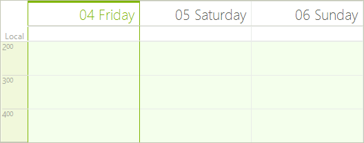
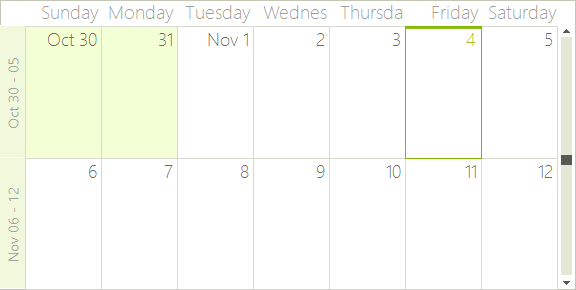

# Working with Views

The scheduler displays dates and times using a "view" that can be [Day](), [MultiDay](), [Week](),  [Work Week](), [Month]() and [Timeline]().
        

>note The difference between a day view and a multi-day view is that while the day view is constrained to showing a single sequence of consecutive days (for example 7th through 10th, or 10th through 12th, or just the 15th), the multi-day view can display all of the above sequences at once.
>

At any one time the scheduler displays a view using a descendant of the __SchedulerView__ class: __SchedulerDayView, SchedulerWeekView, SchedulerMonthView__ and __SchedulerTimelineView__. Each view has special properties particular to the view. Use the RadScheduler __GetDayView()__, __GetWeekView(),__  __GetMonthView()__ and __GetTimelineView()__ methods to get the respective views. Here's an example that retrieves the day view and sets the ruler to start at the second hour and stop at the fifth hour:

#### Get Day View

<snippet id='scheduler-workingwithviews-getdayview-cs' />
<snippet id='scheduler-workingwithviews-getdayview-vb' />

After running the code, the day view for the scheduler looks like this screenshot:

>caption Figure 1: Day View

Change between views by changing the __ActiveViewType__ property to one of the __SchedulerViewType__ enumeration members.

#### ActiveViewType Property

<snippet id='scheduler-workingwithviews-activeviewtype-cs' />
<snippet id='scheduler-workingwithviews-activeviewtype-vb' />

Retrieve the view that is currently being displayed by using the ActiveView property, cast it to be the ActiveViewType.

#### ActiveView Property

<snippet id='scheduler-workingwithviews-weekcount-cs' />
<snippet id='scheduler-workingwithviews-weekcount-vb' />

>caption Figure 2: Week Count

Detect changes to the view by handling the __ActiveViewChanging__ and __ActiveViewChanged__ events. As always, the "Changing" event arguments provide the ability to cancel the view change, but also the "old" and "new" views before and after the view changes transpires:

<snippet id='scheduler-workingwithviews-activeviewchanging-cs' />
<snippet id='scheduler-workingwithviews-activeviewchanging-vb' />

# See Also

* [Common Visual Properties]()
* [Views Walkthrough]()
* [Grouping by Resources]()
* [Exact Time Rendering]()
