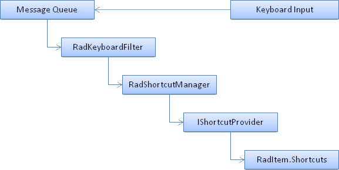

# Shortcuts

Almost each application uses the so-called “*Shortcuts*” – a keyboard combination that triggers a specific action. For a valid shortcut is considered any keyboard combination where a Modifier Key (`Ctrl`, `Alt` and `Shift` or a combination of these) is down and other key(s) is pressed. This semantic is available out-of-the-box in our framework and allows you to seamlessly plug any valid keys combination as an action accelerator. Supported are also the so-called multiple keys shortcuts where the Keys member of each shortcut may be more than one key – e.g. `Ctrl` + `A`, `S` is recognized by the framework. Shortcuts without modifier keys are also supported, but they should be used with caution, since they may be in conflict with other controls which intercept keyboard input.





## How is it done?

The following diagram illustrates the object model and class hierarchy that lie behind each **RadShortcut**:

>caption Figure 1: Shortcuts model

The entire mechanism is controlled by several interfaces and classes which provide very easy and intuitive way to register different shortcuts.

* __RadKeyboardFilter__: This class listens to all keyboard messages that come on the application’s message queue and delegates them to each **IKeyboardListener** registered.

* __RadShortcutManager__: A concrete implementation of **IKeyboardListener** interface which is plugged into the **RadKeyboardFilter** instance. It stores a collection of **IShortcutProvider** instances, recognizes a valid shortcut combination, provided by any of the registered **IShortcutProvider** and calls the IShortcutProvider.**OnShortcut(*RadShortcut*)** callback of the matched provider.

* RadItem.__Shortcuts__: Each **RadItem** implements the **IShortcutProvider** interface and allows a number of shortcuts to be associated with it. When a keyboard combination matches any of the item’s shortcuts, the item’s **Click** event is raised.

# See Also

* [Getting Started (RadMenuItems)]()	
* [Getting Started (RadButtons)]()	
* [Assigning Global RadShortcuts]()	

