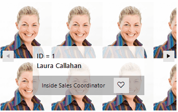

# Data Binding

**RadSlideView** supports data binding functionality which allows you to navigate through the items inside a collection. The control uses a **BindingSource** object which is populated with the records contained in the applied DataSource collection.



1\. First, set the **BindingSource** property to the desired collection. The navigation arrow buttons iterates the collection but the UI is empty yet. 

2\. Define a template to be used for the visual illustration of the collection and set the **TemplateElement** property of RadSlideView. This is actually the visual element that represents the UI for the current item. 

>note If you have a simple scenario with Image and Text you can use the default TemplateElement (LightVisualElement). For more complex scenarios you can build an elements hierarchy that fits your needs. ([Telerik Presentation Framework - LightVisualElement]())

3\. Last, but not least, map each visual element from the applied template with the respective field from the object in the collection. Add a separate **Mapping** for each to the RadSlideView.**Mappings** collection.

>note The mapping is a class used to connect a property from the visual element (Template) to the data bound object that is currently selected. The property type of the element and the data bound object must match. 

>important When the types of the mapped property and the property of the visual element do not match the **MappedPropertyUpdating** event has to be used to convert the value type to the visual element property type. If not converted, the property will not be mapped. In example below the mapped property is of type Integer(Id), but the visual element property is of type String(Text) and in the MappedPropertyUpdating event we convert the value to string type and format the string.
 
{{source=..\SamplesCS\SlideView\SlideViewBinding.cs region=DataBinding}} 
{{source=..\SamplesVB\SlideView\SlideViewBinding.vb region=DataBinding}}

````C#

         private void BindSlideView()
        {
           BindingList<Employee> employees = new BindingList<Employee>();
            employees.Add(new Employee(1, "Laura Callahan", "Inside Sales Coordinator", Properties.Resources.laura));
            employees.Add(new Employee(2, "Michael Suyama", "Sales Representative", Properties.Resources.michael));
            employees.Add(new Employee(1, "Anne Dodsworth", "Sales Manager", Properties.Resources.anne));
            BindingSource bs = new BindingSource();
            bs.DataSource = employees;
            this.radSlideView1.BindingSource = bs;

            GalleryTemplate template = new GalleryTemplate();
            this.radSlideView1.Mappings.Add(new Mapping(template, LightVisualElement.BackgroundImageProperty, nameof(Employee.Photo)));
            this.radSlideView1.Mappings.Add(new Mapping(template.LabelId, LightVisualElement.TextProperty, nameof(Employee.Id)));
            this.radSlideView1.Mappings.Add(new Mapping(template.LabelName, LightVisualElement.TextProperty, nameof(Employee.Name)));
            this.radSlideView1.Mappings.Add(new Mapping(template.LabelTitle, LightVisualElement.TextProperty, nameof(Employee.Title)));
            this.radSlideView1.MappedPropertyUpdating += RadSlideView1_MappedPropertyUpdating;
            this.radSlideView1.TemplateElement = template;

        }

        private void RadSlideView1_MappedPropertyUpdating(object sender, MappedPropertyUpdatingEventArgs e)
        { 
            if (e.PropertyName == nameof(Employee.Id))
            {
                e.Value = $"ID = {e.Value}";
            }
        }

        internal class GalleryTemplate : LightVisualElement
        {
            public StackLayoutElement Panel { get; private set; }

            public StackLayoutElement LabelsPanel { get; private set; }
            public LightVisualElement LabelId { get; private set; }
            public LightVisualElement LabelName { get; private set; }

            public StackLayoutElement ButtonsPanel { get; private set; } 
            public LightVisualElement LabelTitle { get; private set; } 
            public GlyphButtonElement ButtonLike { get; private set; } 

            protected override void CreateChildElements()
            {
                base.CreateChildElements();

                this.BackgroundImageLayout = ImageLayout.Tile;
                this.Panel = new StackLayoutElement()
                {
                    Alignment = ContentAlignment.BottomCenter,
                    Orientation = Orientation.Vertical,
                    Margin = new Padding(30),
                    StretchHorizontally = false,
                    StretchVertically = false,
                    MinSize = new Size(150, 75)
                };
                this.Children.Add(this.Panel);

                this.LabelsPanel = new StackLayoutElement { Orientation = Orientation.Vertical, DrawFill = true, 
                    GradientStyle = GradientStyles.Solid, StretchHorizontally = true, Padding = new Padding(6, 4, 6, 4),
                    BackColor = Color.FromArgb(200, Color.White),
                };
                this.Panel.Children.Add(this.LabelsPanel);

                 Font font = new Font("Segoe UI Semibold", 10f);
                this.LabelId = new LightVisualElement  { Font = font, ForeColor = Color.Black, TextAlignment = ContentAlignment.BottomLeft };
                this.LabelName = new LightVisualElement()  { Font = font, ForeColor = Color.Black, TextAlignment = ContentAlignment.TopLeft };
                this.LabelsPanel.Children.Add(this.LabelId);
                this.LabelsPanel.Children.Add(this.LabelName);

                this.ButtonsPanel = new StackLayoutElement
                {
                    Orientation = Orientation.Horizontal,
                    DrawFill = true,
                    GradientStyle = GradientStyles.Solid,
                    BackColor = Color.FromArgb(200, Color.DarkGray),
                    Padding = new Padding(10, 4, 10, 4),
                    ElementSpacing = 10,
                    StretchHorizontally = true,
                    StretchVertically = true,
                };
                this.Panel.Children.Add(this.ButtonsPanel);

                this.LabelTitle = new LightVisualElement() { Alignment = ContentAlignment.MiddleLeft, 
                    Padding = new Padding(6, 0, 6, 0), StretchHorizontally = false, StretchVertically = false, MinSize = new Size(0, 30) };
                this.LabelTitle.UnbindProperty(RadElement.StretchVerticallyProperty);
                this.LabelTitle.StretchVertically = true;
                this.ButtonsPanel.Children.Add(this.LabelTitle);

                this.ButtonLike = new GlyphButtonElement(TelerikWebUIFont.GlyphHeartOutline);
                this.ButtonLike.Click += this.ButtonLike_Click;
                this.ButtonsPanel.Children.Add(this.ButtonLike); 
 
            }

            private void ButtonLike_Click(object sender, EventArgs e)
            {
                if (sender is RadButtonElement button)
                {
                    if (button.Text == TelerikWebUIFont.GlyphHeart)
                    {
                        button.Text = TelerikWebUIFont.GlyphHeartOutline;
                        button.ResetLocalValue(ForeColorProperty);
                    }
                    else
                    {
                        button.Text = TelerikWebUIFont.GlyphHeart;
                        button.ForeColor = Color.FromArgb(225, 19, 20);
                    }
                }
            }

            internal class GlyphButtonElement : RadButtonElement
            {
                public GlyphButtonElement(string glyph, bool circleShape = false) :
                    base(glyph)
                {
                    if (circleShape)
                    {
                        this.SetThemeValueOverride(ShapeProperty, new CircleShape(), string.Empty);
                    }
                }


                protected override void OnLoaded()
                {
                    base.OnLoaded();

                    Font glyphFont = new Font(ThemeResolutionService.GetCustomFont(ThemeResolutionService.WebComponentsIconsFontName), 12f);
                    this.SetThemeValueOverride(FontProperty, glyphFont, string.Empty, typeof(TextPrimitive));
                    this.Alignment = ContentAlignment.MiddleLeft;
                    this.Padding = new Padding(3, 6, 3, 4);
                    this.StretchHorizontally = false;
                    this.StretchVertically = false;
                    this.MinSize = new Size(30, 30);
                    this.MaxSize = new Size(30, 30);
                    if (this.Shape?.GetType() == typeof(CircleShape))
                    {
                        this.EnableBorderHighlight = false;
                        this.ButtonFillElement.SmoothingMode = System.Drawing.Drawing2D.SmoothingMode.AntiAlias;
                    }
                }

                protected override Type ThemeEffectiveType
                {
                    get { return typeof(RadButtonElement); }
                }
            }
        } 

        public class Employee
        {
            public Employee(int _id, string _name, string _title, Bitmap _photo)
            {
                Id = _id;
                Name = _name;
                Title = _title;
                Photo = _photo;
            }

            public int Id { get; set; }
            public string Name { get; set; } 
            public string Title { get; set; } 
            public Image Photo { get; set; }
            
        }
      
````
````VB.NET

 
```` 

{{endregion}}

 

## See Also

* [Structure]()