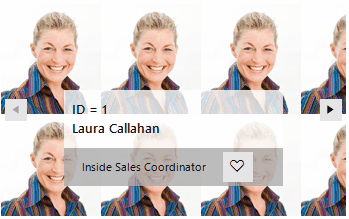

# Data Binding

**RadSlideView** supports data binding functionality which allows you to navigate through the items inside a collection. The control uses a **BindingSource** object which is populated with the records contained in the applied DataSource collection.

1\. First, set the **BindingSource** property to the desired collection. The navigation arrow buttons iterate the collection but the UI is empty yet. 

2\. Define a template to be used for the visual illustration of the collection and set the **TemplateElement** property of RadSlideView. This is actually the visual element that represents the UI for the current item. 

>note If you have a simple scenario with Image and Text you can use the default TemplateElement (LightVisualElement). For more complex scenarios you can build an elements hierarchy that fits your needs. ([Telerik Presentation Framework - LightVisualElement]())

3\. Last, but not least, map each visual element from the applied template with the respective field from the object in the collection. Add a separate **Mapping** for each to the RadSlideView.**Mappings** collection.

>note The mapping is a class used to connect a property from the visual element (Template) to the data bound object that is currently selected. The property type of the element and the data bound object must match. 

>important When the types of the mapped property and the property of the visual element do not match the **MappedPropertyUpdating** event has to be used to convert the value type to the visual element property type. If not converted, the property will not be mapped. In the example below the mapped property is of type Integer(Id), but the visual element property is of type String(Text), and in the MappedPropertyUpdating event we convert the value to string type and format the string.
 
<snippet id='slideview-slideviewbinding-databinding-cs' />
<snippet id='slideview-slideviewbinding-databinding-vb' />

## See Also

* [Structure]()
* [Unbound Mode]()
