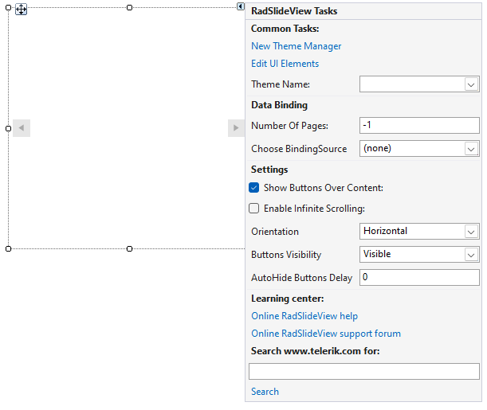

# Design Time

To start using __RadSlideView__, just drag it from the toolbox and drop it onto the form.

## Smart Tag

Select RadSlideView and click the small arrow on the top right position in order to open the Smart Tag. It allows you to set different settings at design time:

* __Common Tasks__

    *  __New Theme Manager__: Adds a new RadThemeManager component to the form.

    * __Edit UI elements__: Opens a dialog that displays the Element Hierarchy Editor. This editor lets you browse all the elements in the control.

    * __Theme Name__: Select a theme name from the drop down list of themes available for that control. Selecting a theme allows you to change all aspects of the controls visual style at one time.

* __Data Binding__:

    * __Number Of Pages__: Gets or sets the number of pages. If BindingSource is set, this property returns the BindingSource.Count.

    * __Choose BindingSource__: Gets or sets the data source.

* __Settings__:

    * __Show Buttons Over Content__: Gets or sets a boolean value indicating whether previous and next buttons will be shown over content or outside it. The default value is true, with which the buttons will be displayed over the content.

    * __Enable Infinite Scrolling__: Determines whether infinite scrolling from last to first slideview item and vice versa is enabled.
   
    * __Orientation__: Gets or sets a value indicating how to orient the navigation buttons - horizontally or vertically.

    * __Buttons Visibility__: Determines whether and how to display the navigation buttons.

    * __AutoHide Buttons Delay__: Determines how long it takes to the navigation buttons to be hidden after the mouse leaves the control(in milliseconds). Used only when the ButtonsVisibility is VisibleOnMouseOver.

* __Learning Center__: Navigate to the Telerik help, code library projects or support forum.

* __Search__: Search the Telerik site for a given string.

## See Also

* [Structure]()