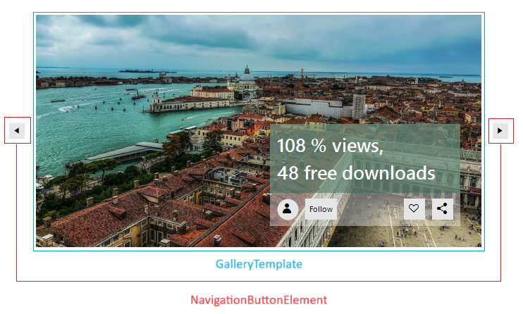
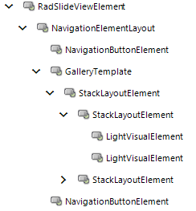

# Structure

This article describes the inner structure and organization of the elements which build __RadSlideView__. 

* __GalleryTemplate__: Displays the currently selected item. It may also contain a StackLayoutElement composed of nested StackLayoutElements and LightVisualElements to offer the above UI with information about the % views and number of downloads

* __NavigationButtonElement__: Navigation buttons used for moving forward/backward the current item.

## Elements Hierarchy

## See Also

* [Getting Started]()