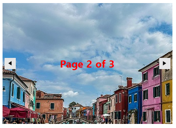

# SlideView TemplateElement

**TemplateElement** is responsipble to display content showing the users some useful information. This is actually the visual element that represents the UI for the current item in **RadSlideView**. You can design any custom layout according to specific client needs.

### Unbound Mode

For a simple scenario with displaying Image and Text in unbound mode you can use the default TemplateElement (LightVisualElement). In unbound mode the RadSlideView control navigates through the defined fixed number of pages by setting the **NumberOfPages** property. The **TemplateUpdate** event fires after all mappings have been applied, just before the slideview template is about to change. Here is the appropriate place to change the template styles and properties considering the RadSlideView.**SelectedIndex**.

>note For more complex scenarios you can build an elements hierarchy that fits your needs. Please refer to [Telerik Presentation Framework]()). 
More advanced TemplateElement example is demonstrated in the Demo application >> SlideView >> First look. 



#### Setup template
{{source=..\SamplesCS\SlideView\GettingStartedGallery.cs region=SetupTemplate}} 
{{source=..\SamplesVB\SlideView\GettingStartedGallery.vb region=SetupTemplate}}

````C#
private void SetupTemplate()
{ 
    this.radSlideView1.NumberOfPages = 3;
    this.radSlideView1.TemplateElement.DrawFill = true;
    this.radSlideView1.TemplateElement.GradientStyle = GradientStyles.Solid;
    this.radSlideView1.TemplateElement.BackColor = Color.White;
}
private void RadSlideView1_TemplateUpdated(object sender, TemplateUpdatedEventArgs e)
{
    Image image = images[this.radSlideView1.SelectedIndex];
    this.radSlideView1.TemplateElement.Image = image;
    this.radSlideView1.TemplateElement.Text = $"Page {this.radSlideView1.SelectedIndex + 1} of {this.radSlideView1.NumberOfPages}";
    this.radSlideView1.TemplateElement.ForeColor = Color.Red;
    this.radSlideView1.TemplateElement.Font = new Font("Segoe UI", 15, FontStyle.Bold);
}

````
````VB.NET 
    Private Sub SetupTemplate()
        Me.radSlideView1.NumberOfPages = 3
        Me.radSlideView1.TemplateElement.DrawFill = True
        Me.radSlideView1.TemplateElement.GradientStyle = GradientStyles.Solid
        Me.radSlideView1.TemplateElement.BackColor = Color.White
    End Sub
    Private Sub RadSlideView1_TemplateUpdated(ByVal sender As Object, ByVal e As TemplateUpdatedEventArgs)
        Dim image As Image = images(Me.radSlideView1.SelectedIndex)
        Me.radSlideView1.TemplateElement.Image = image
        Me.radSlideView1.TemplateElement.Text = $"Page {Me.radSlideView1.SelectedIndex + 1} of {Me.radSlideView1.NumberOfPages}"
        Me.radSlideView1.TemplateElement.ForeColor = Color.Red
        Me.radSlideView1.TemplateElement.Font = New Font("Segoe UI", 15, FontStyle.Bold)
    End Sub
    
```` 

>note For more detailed information please refer to [Unbound mode]().

>important TemplateUpdate event can be used in both bound/unbound mode.

### Bound Mode

In bound mode you can use mappings, but it is important that the property type of the element and the data bound object should match. Otherwise the property will not be set (if we try to set a value of different type the RadProperty setter will throw an exception). In this case the **MappedPropertyUpdating** event needs to be handled and set the Value of the EventArgs to match the destination type.

>note For more detailed information please refer to [Data Binding]().

## See Also

* [Getting Started]()
* [Structure]()
* [Navigation buttons]()
