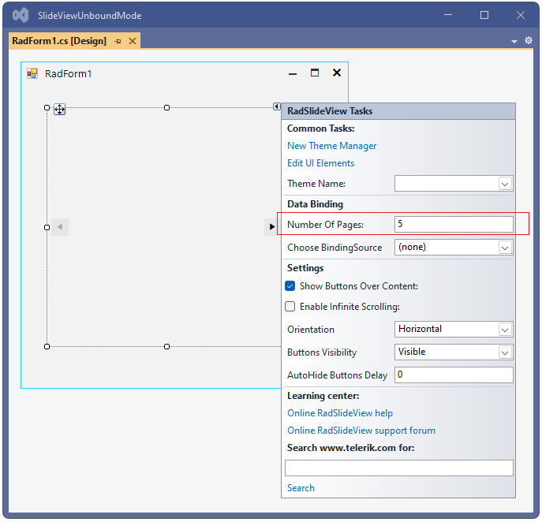

# Unbound Mode

When in unbound mode RadSlideView does not use a data source collection for iterating a collection of records. The control navigates through the defined fixed number of pages either by setting the **NumberOfPages** property at run time or by specifying it at design time:
 


When sliding between the pages, the **TemplateUpdated** event is fired. Since BindingSource is not assigned in this scenario, the event handler provides you access to the visual template, just before the animation is started. This is the appropriate place to load the relevant information to the template considering the RadSlideView.**SelectedIndex** value. By default, the RadSlideView.**TemplateElement** is LightVisualElement which will be used here for simplicity of the example. 

>note More advanced TemplateElement is demonstrated in the Demo application >> SlideView >> First look example which also shows the smooth integration between RadSlideView and [RadPipsPager]()

Let's consider that we have a folder "Gallery" with 5 images. When navigating through the pages, a different image will be loaded in the template:


 
{{source=..\SamplesCS\SlideView\SlideViewBinding.cs region=UnboundMode}} 
{{source=..\SamplesVB\SlideView\SlideViewBinding.vb region=UnboundMode}}

````C#

        private void UnboundMode()
        {
            this.radSlideView1.TemplateUpdated += RadSlideView1_TemplateUpdated;
            this.radSlideView1.NumberOfPages = 5;
        }

        private void RadSlideView1_TemplateUpdated(object sender, Telerik.WinControls.UI.SlideView.TemplateUpdatedEventArgs e)
        {
            int imageIndex = this.radSlideView1.SelectedIndex + 1;
            e.Template.Image = Image.FromFile(@"..\..\Gallery\Image" + imageIndex + ".png");
        }      
      
````
````VB.NET 

    Private Sub UnboundMode()
        AddHandler Me.radSlideView1.TemplateUpdated, AddressOf RadSlideView1_TemplateUpdated
        Me.radSlideView1.NumberOfPages = 5
    End Sub

    Private Sub RadSlideView1_TemplateUpdated(sender As Object, e As TemplateUpdatedEventArgs)
        Dim imageIndex = Me.radSlideView1.SelectedIndex + 1
        e.Template.Image = Image.FromFile("..\..\Gallery\Image" & imageIndex & ".png")
    End Sub
    
```` 

{{endregion}}


## See Also

* [Structure]()
* [Data Binding]()
