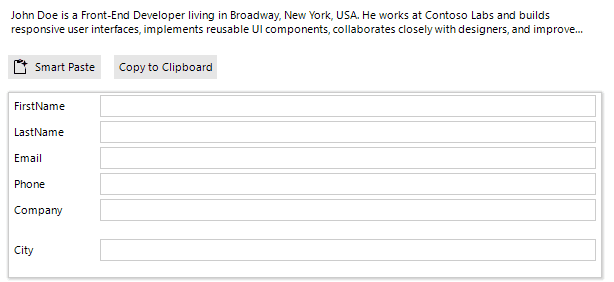

# WinForms SmartPasteButton Overview

The Telerik UI for WinForms SmartPasteButton is an AI-powered component that streamlines data entry by extracting structured information from clipboard content and automatically populating form fields. 

When users paste unstructured text copied from the clipboard, the SmartPasteButton sends the content to an AI service, which analyzes the text and returns structured values mapped to the appropriate fields based on the form structure. This improves data entry efficiency and enhances the user experience.

## Next Steps

* [Getting Started with Telerik UI for WinForms SmartPasteButton]()

## See Also

* [Getting Started with SmartPasteButton]()
* [Customizing the SmartPasteButton]()

## Telerik UI for WinForms Learning Resources

* [Telerik UI for WinForms API Reference](https://docs.telerik.com/devtools/winforms/api/)
* [Getting Started with Telerik UI for WinForms Components]() 
* [Telerik UI for WinForms Virtual Classroom (Training Courses for Registered Users)](https://learn.telerik.com/learn/course/external/view/elearning/17/TelerikUIforWinForms) 
* [Telerik UI for WinForms Forum](https://www.telerik.com/forums/winforms)
* [Telerik UI for WinForms Knowledge Base](https://docs.telerik.com/devtools/winforms/knowledge-base)

## Telerik UI for WinForms Additional Resources
* [Telerik UI for WinForms Product Overview](https://www.telerik.com/products/winforms.aspx)
* [Telerik UI for WinForms Blog](https://www.telerik.com/blogs/desktop-winforms)
* [Telerik UI for WinForms Videos](https://www.telerik.com/videos/product/winforms)
* [Telerik UI for WinForms Roadmap](https://www.telerik.com/support/whats-new/winforms/roadmap)
* [Telerik UI for WinForms Pricing](https://www.telerik.com/purchase/individual/winforms.aspx)
* [Telerik UI for WinForms Code Library](https://www.telerik.com/support/code-library/winforms)
* [Telerik UI for WinForms Support](https://www.telerik.com/support/winforms)
* [What’s New in Telerik UI for WinForms](https://www.telerik.com/support/whats-new/winforms)
