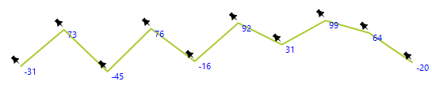

# Custom Painting

__RadSparkline__ provides you with two event that allows to style any of the painted elements. The events are __PaintSparkStroke__ and __PaintSparkFill__. The events will be fired for each element and allow you to change its properties or directly paint on the sparkline surface. The event arguments are providing the following properties:
* __Cancel:__ Allows you to cancel the current element painting.
* __Graphics:__ The Graphics object that allows you to paint. 
* __Path:__ The path of the current element. 
* __Context:__ The currently painted element.
* __StrokePen:__ The default Pen used for the current element (PaintSparkStroke event only).
* __FillBrush:__ The default Brush used for the current element (PaintSparkFill event only).


The following examples demonstrates how you can use the above events.

#### Using the Paint Events 

{{source=..\SamplesCS\Sparkline\SparklineCode.cs region=CustomPaint}} 
{{source=..\SamplesVB\Sparkline\SparklineCode.vb region=CustomPaint}}
````C#
Font labelFont = new Font("Segoe UI", 8, FontStyle.Regular);
Image pointIcon = Image.FromFile(@"C:\img\pin.png").GetThumbnailImage(16, 16, null, IntPtr.Zero);
private void RadSparkline1_PaintSparkStroke(object sender, PaintSparkStrokeEventArgs e)
{
    if (e.Context is CategoricalSparkDataPoint)
    {
        e.Cancel = true;
        var point = new PointF(e.Path.PathPoints[0].X - 16, e.Path.PathPoints[0].Y - 16);
        e.Graphics.DrawImage(pointIcon, point);
    }
}
private void RadSparkline1_PaintSparkFill(object sender, PaintSparkFillEventArgs e)
{
    if (e.Context is CategoricalSparkDataPoint)
    {
        e.Cancel = true;
        var value = (e.Context as CategoricalSparkDataPoint).Value;
        e.Graphics.DrawString(value.ToString(), labelFont, Brushes.Blue, e.Path.PathPoints[0].X, e.Path.PathPoints[0].Y);
    }
}

````
````VB.NET
Private labelFont As New Font("Segoe UI", 8, FontStyle.Regular)
Private pointIcon As Image = Image.FromFile("C:\img\pin.png").GetThumbnailImage(16, 16, Nothing, IntPtr.Zero)
Private Sub RadSparkline1_PaintSparkStroke(ByVal sender As Object, ByVal e As PaintSparkStrokeEventArgs)
    If TypeOf e.Context Is CategoricalSparkDataPoint Then
        e.Cancel = True
        Dim point = New PointF(e.Path.PathPoints(0).X - 16, e.Path.PathPoints(0).Y - 16)
        e.Graphics.DrawImage(pointIcon, point)
    End If
End Sub
Private Sub RadSparkline1_PaintSparkFill(ByVal sender As Object, ByVal e As PaintSparkFillEventArgs)
    If TypeOf e.Context Is CategoricalSparkDataPoint Then
        e.Cancel = True
        Dim value = (TryCast(e.Context, CategoricalSparkDataPoint)).Value
        e.Graphics.DrawString(value.ToString(), labelFont, Brushes.Blue, e.Path.PathPoints(0).X, e.Path.PathPoints(0).Y)
    End If
End Sub

````
 

{{endregion}} 

>caption Figure 1: Custom Paint




