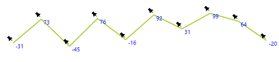

# Custom Painting

__RadSparkline__ provides you with two events that allows to style any of the painted elements. The events are __PaintSparkStroke__ and __PaintSparkFill__. The events will be fired for each element and allow you to change its properties or directly paint on the sparkline surface. The event arguments are providing the following properties:
* __Cancel:__ Allows you to cancel the current element painting.
* __Graphics:__ The Graphics object that allows you to paint. 
* __Path:__ The path of the current element. 
* __Context:__ The currently painted element.
* __StrokePen:__ The default Pen used for the current element (PaintSparkStroke event only).
* __FillBrush:__ The default Brush used for the current element (PaintSparkFill event only).

The following examples demonstrates how you can use the above events.

#### Using the Paint Events 

<snippet id='sparkline-sparklinecode-custompaint-cs' />
<snippet id='sparkline-sparklinecode-custompaint-vb' />

>caption Figure 1: Custom Paint

