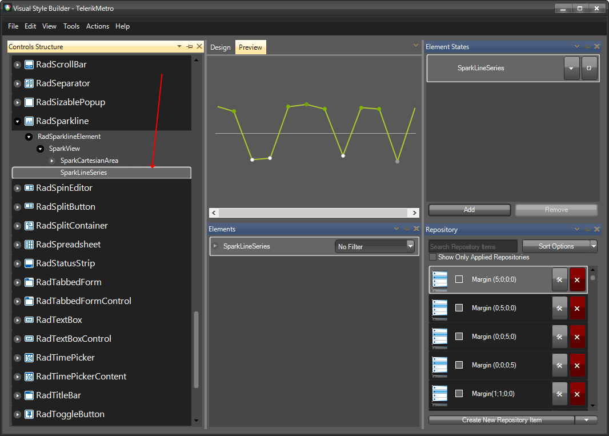
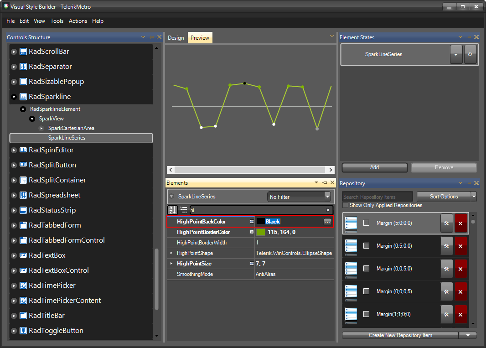
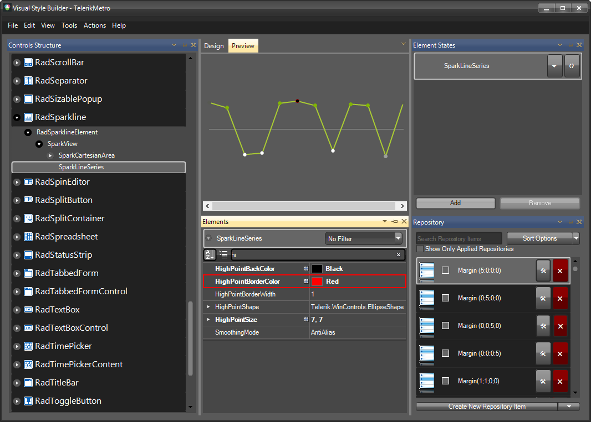
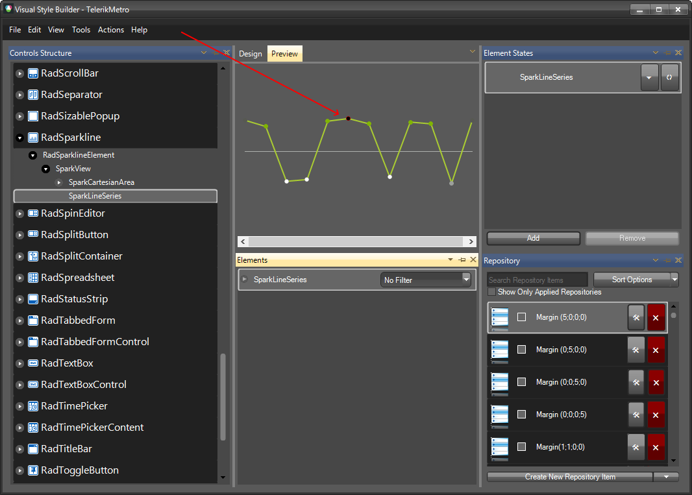

# Themes

This help article will demonstrate a step by step tutorial how to customize the Metro theme for __RadSparkLine__.

1. Open [Visual Style Builder] ().
2. Export the built-in themes in a specific folder by selecting `File` >> `Export Built-in Themes`.
3. Load a desired theme from the just exported files by selecting `File` >> `Open Package`.
4. Expand **RadSparkLine** and select the `SparkLineSeries`. 
   

5. For the `Elements` window, navigate to the __HighPointBackColor__ property, and change its value.
   

6. Change the __HighPointBorderColor__ as well.
   

7.  The bellow image shows the result.
   

>note The following article shows how you can use the new theme: [Using Custom Themes]().

