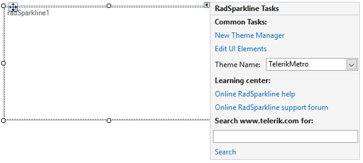

# Design Time

Select **RadSparkline** and click the small arrow on the top right position in order to open the __Smart Tag__. The __Smart Tag__ of **RadSparkline** lets you quickly access common tasks involved with accessing **RadSparkline** elements.

>caption Figure 1: Smart Tag

**Common Tasks:**

* **New Theme Manager:** adds a new [RadThemeManager]() component to the form.
            
* **Edit UI Elements:** allows setting properties at multiple levels of the class hierarchy.
            
* **Theme Name:** allows you to set the theme for the control.

**Learning Center:** Navigate to the Telerik help, code library projects or support forum.

**Search:** Search in the forum for a given string. 

