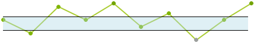

# Annotations

 Annotations are visual elements that can be used to highlight certain areas on the plot area and denote significant values. The currently supported annotations are __Grid Line__ and __Plot Band__. This article shows examples for both.

Common properties to the all types of annotations are:

* __BorderDashStyle:__ Defines the dash style of the border of the annotation

* __BorderColor:__ Sets the color of the border of the annotation

* __BorderWidth:__ Specifies the width of the border of the annotation

## Grid Line Annotation

Grid line annotations are lines or circles that cross the chart grid at location on the axis, specified by their __Value__ property.

Here is how the GridLine annotation looks like.

>caption Figure 1: CartesianSparkGridLineAnnotation


The following example shows how you can create a Grid Line annotation.

#### Add Plot Band Annotation 

{{source=..\SamplesCS\Sparkline\SparklineCode.cs region=GridLineAnnotation}} 
{{source=..\SamplesVB\Sparkline\SparklineCode.vb region=GridLineAnnotation}}
````C#
public void AddGridLineAnnotation()
{
    CartesianSparkGridLineAnnotation annotation1 = new CartesianSparkGridLineAnnotation();
    annotation1.Axis = this.radSparkline1.Axes[1] as SparkCartesianAxis;
    annotation1.Value = 3;
    annotation1.BorderColor = Color.Red;
    annotation1.BorderDashStyle = DashStyle.Solid;
    annotation1.BorderWidth = 1;
    this.radSparkline1.Annotations.Add(annotation1);
    CartesianSparkGridLineAnnotation annotation2 = new CartesianSparkGridLineAnnotation();
    annotation2.Axis = this.radSparkline1.Axes[0] as SparkCartesianAxis;
    annotation2.Value = "Test";
    annotation2.BorderColor = Color.Blue;
    annotation2.BorderDashStyle = DashStyle.Solid;
    annotation2.BorderWidth = 1;
    this.radSparkline1.Annotations.Add(annotation2);
}

````
````VB.NET
Public Sub AddGridLineAnnotation()
    Dim annotation1 As New CartesianSparkGridLineAnnotation()
    annotation1.Axis = TryCast(Me.radSparkline1.Axes(1), SparkCartesianAxis)
    annotation1.Value = 3
    annotation1.BorderColor = Color.Red
    annotation1.BorderDashStyle = DashStyle.Solid
    annotation1.BorderWidth = 1
    Me.radSparkline1.Annotations.Add(annotation1)
    Dim annotation2 As New CartesianSparkGridLineAnnotation()
    annotation2.Axis = TryCast(Me.radSparkline1.Axes(0), SparkCartesianAxis)
    annotation2.Value = "Test"
    annotation2.BorderColor = Color.Blue
    annotation2.BorderDashStyle = DashStyle.Solid
    annotation2.BorderWidth = 1
    Me.radSparkline1.Annotations.Add(annotation2)
End Sub

````
 

{{endregion}} 

Properties specific to the Grid Line Annotations are:

* __Axis:__ The Cartesian grid line annotation needs to be associated with horizontal or vertical axis explicitly.
            
* __Value__ (of type object): The place on the associated axis where the annotation crosses it. When the associated axis is numerical (linear or logarithmic) a numeric value is expected and when it is a categorical - a category.

* __Label:__ This property allows you to display text near the annotation and indicate what it is for.


## Plot Band Annotation

Cartesian plot band annotation is either a horizontal or a vertical stripe that crosses from start to end the vertical or the horizontal axis respectively.

Here is how the Plot Band annotation looks like.

>caption Figure 2: CartesianSparkPlotBandAnnotation



The following example shows how you can create a Plot Band annotation.

#### Add Plot Band Annotation 

{{source=..\SamplesCS\Sparkline\SparklineCode.cs region=PlotBandAnnotation}} 
{{source=..\SamplesVB\Sparkline\SparklineCode.vb region=PlotBandAnnotation}}
````C#
public void AddPlotBandAnottation()
{
    CartesianSparkPlotBandAnnotation annotation1 = new CartesianSparkPlotBandAnnotation();
    annotation1.Axis = this.radSparkline1.Axes[1] as SparkCartesianAxis;
    annotation1.From = -2;
    annotation1.To = 2;
    annotation1.BackColor = Color.FromArgb(100, Color.LightBlue);
    annotation1.BorderColor = Color.Black;
    annotation1.BorderWidth = 1;
    this.radSparkline1.Annotations.Add(annotation1);
}

````
````VB.NET
Public Sub AddPlotBandAnottation()
    Dim annotation1 As New CartesianSparkPlotBandAnnotation()
    annotation1.Axis = TryCast(Me.radSparkline1.Axes(1), SparkCartesianAxis)
    annotation1.From = -2
    annotation1.To = 2
    annotation1.BackColor = Color.FromArgb(100, Color.LightBlue)
    annotation1.BorderColor = Color.Black
    annotation1.BorderWidth = 1
    Me.radSparkline1.Annotations.Add(annotation1)
End Sub

````
 

{{endregion}} 
 
 
Properties specific to the Plot Band Annotations are:

* __Axis:__ The Cartesian plotBand annotation needs to be associated with horizontal or vertical axis explicitly.

* __From__ (of type object): The starting point for the plot band. When the associated axis is numerical (Linear or Logarithmic) a numeric value is expected and when it is a  __CategoricalAxis__ - a category.

* __To__ (of type object): The ending point for the plot band. When the associated axis is numerical (Linear or Logarithmic) a numeric value is expected and when it is a __CategoricalAxis__ - a category.

* __Label:__ This property allows you to display text near the annotation and indicate what it is for.


