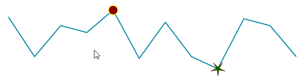

# Indicators

__RadSparkline__ support the following indicators out of the box:
* High Point
* Low Point
* Negative Point
* First Point
* Last Point


The following image show how the indicator look with different kind of series.

>caption Figure 1: Indicators 


When the indicators are enabled the color of the respected point will be changed. You can customize the style of the indicators. The indicators properties are listed in the following article [Series Overview]().


The below example shows how you can customize the indicators by setting some properties. 

#### Customize Indicators Example

{{source=..\SamplesCS\Sparkline\SparklineCode.cs region=Indicators}} 
{{source=..\SamplesVB\Sparkline\SparklineCode.vb region=Indicators}}
````C#
public void StyleIndicators()
{
    SparkLineSeries series = new SparkLineSeries();
    series.ShowHighPointIndicator = true;
    series.ShowLowPointIndicator = true;
    series.HighPointBackColor = Color.DarkRed;
    series.HighPointBorderWidth = 3;
    series.HighPointBorderColor = Color.Yellow;
    series.HighPointSize = new SizeF(20, 20);
    series.LowPointShape = new StarShape(5, 5);
    series.LowPointBackColor = Color.DarkGreen;
    series.DataPoints.AddRange(GetPoints());
    radSparkline1.Series = series;
}

````
````VB.NET
Public Sub StyleIndicators()
    Dim series As New SparkLineSeries()
    series.ShowHighPointIndicator = True
    series.ShowLowPointIndicator = True
    series.HighPointBackColor = Color.DarkRed
    series.HighPointBorderWidth = 3
    series.HighPointBorderColor = Color.Yellow
    series.HighPointSize = New SizeF(20, 20)
    series.LowPointShape = New StarShape(5, 5)
    series.LowPointBackColor = Color.DarkGreen
    series.DataPoints.AddRange(GetPoints())
    radSparkline1.Series = series
End Sub

````
 


{{endregion}} 

>caption Figure 2: Show and Customize Indicators



