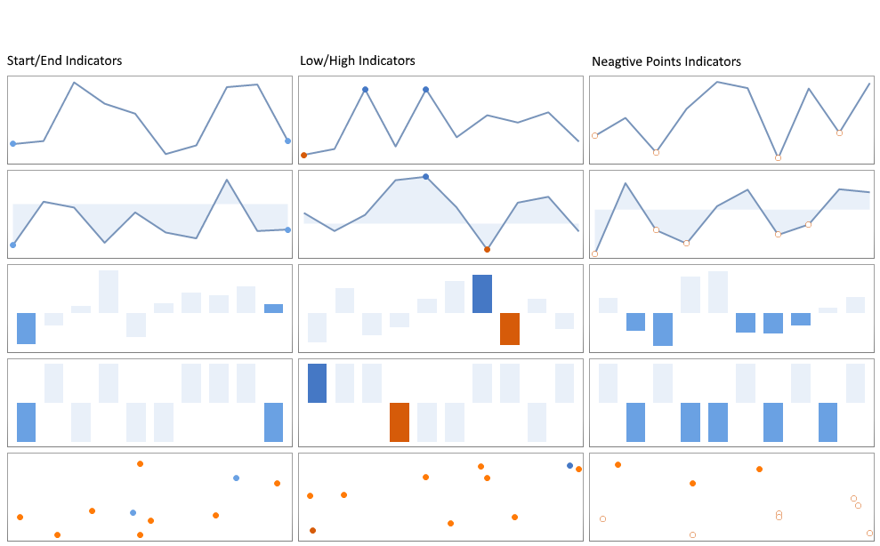
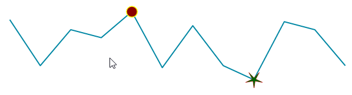

# Indicators

__RadSparkline__ support the following indicators out of the box:
* High Point
* Low Point
* Negative Point
* First Point
* Last Point

The following image show how the indicator look with different kind of series.

>caption Figure 1: Indicators 

When the indicators are enabled the color of the respected point will be changed. You can customize the style of the indicators. The indicators properties are listed in the following article [Series Overview]().

The below example shows how you can customize the indicators by setting some properties. 

#### Customize Indicators Example

<snippet id='sparkline-sparklinecode-indicators-cs' />
<snippet id='sparkline-sparklinecode-indicators-vb' />

>caption Figure 2: Show and Customize Indicators

