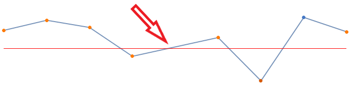

# Null Values Support

In __RadSparkline__ the __EmptyPointBehavior__ property controls what happens with null points. The possible values are: 
* __ShowAsBlank:__ The null points would not be painted on the chart and a blank spot will appear.
* __ShowAsZero:__ The null point will be considered as 0 on the Y axis.
* __DoNotShow:__ The null point would not be painted on the chart.

{{source=..\SamplesCS\Sparkline\SparklineCode.cs region=SparklineNullValueSupport}} 
{{source=..\SamplesVB\Sparkline\SparklineCode.vb region=SparklineNullValueSupport}}

````C#

public void AddSeries()
{
    SparkLineSeries lineSeries = new SparkLineSeries();
    lineSeries.DataPoints.Add(new CategoricalSparkDataPoint(13));
    lineSeries.DataPoints.Add(new CategoricalSparkDataPoint(20));
    lineSeries.DataPoints.Add(new CategoricalSparkDataPoint(15));
    lineSeries.DataPoints.Add(new CategoricalSparkDataPoint(-5));
    lineSeries.DataPoints.Add(new CategoricalSparkDataPoint(null));
    lineSeries.DataPoints.Add(new CategoricalSparkDataPoint(8));
    lineSeries.DataPoints.Add(new CategoricalSparkDataPoint(-22));
    lineSeries.DataPoints.Add(new CategoricalSparkDataPoint(22));
    lineSeries.DataPoints.Add(new CategoricalSparkDataPoint(12));
    lineSeries.ShowMarkers = true;
    lineSeries.ShowHighPointIndicator = true;
    lineSeries.ShowLowPointIndicator = true;
    radSparkline1.Series = lineSeries;
    CartesianSparkGridLineAnnotation annotation1 = new CartesianSparkGridLineAnnotation();
    annotation1.Axis = this.radSparkline1.Axes[1] as SparkCartesianAxis;
    annotation1.Value = 0;
    annotation1.BorderColor = Color.Red;
    annotation1.BorderDashStyle = DashStyle.Solid;
    annotation1.BorderWidth = 1;
    this.radSparkline1.Annotations.Add(annotation1);
}

	

````
````VB.NET

Public Sub AddSeries()
    Dim lineSeries As SparkLineSeries = New SparkLineSeries()
    lineSeries.DataPoints.Add(New CategoricalSparkDataPoint(13))
    lineSeries.DataPoints.Add(New CategoricalSparkDataPoint(20))
    lineSeries.DataPoints.Add(New CategoricalSparkDataPoint(15))
    lineSeries.DataPoints.Add(New CategoricalSparkDataPoint(-5))
    lineSeries.DataPoints.Add(New CategoricalSparkDataPoint(Nothing))
    lineSeries.DataPoints.Add(New CategoricalSparkDataPoint(8))
    lineSeries.DataPoints.Add(New CategoricalSparkDataPoint(-22))
    lineSeries.DataPoints.Add(New CategoricalSparkDataPoint(22))
    lineSeries.DataPoints.Add(New CategoricalSparkDataPoint(12))
    lineSeries.ShowMarkers = True
    lineSeries.ShowHighPointIndicator = True
    lineSeries.ShowLowPointIndicator = True
    radSparkline1.Series = lineSeries
    Dim annotation1 As CartesianSparkGridLineAnnotation = New CartesianSparkGridLineAnnotation()
    annotation1.Axis = TryCast(Me.radSparkline1.Axes(1), SparkCartesianAxis)
    annotation1.Value = 0
    annotation1.BorderColor = Color.Red
    annotation1.BorderDashStyle = DashStyle.Solid
    annotation1.BorderWidth = 1
    Me.radSparkline1.Annotations.Add(annotation1)
End Sub


````


>caption Figure 1: ShowAsBlank


>caption Figure 2: ShowAsZero


>caption Figure 3: DoNotShow


