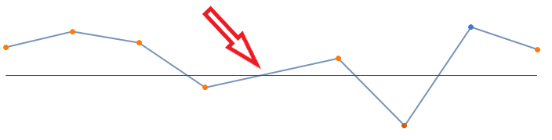

# Null Values Support

In __RadSparkline__ the __EmptyPointBehavior__ property controls what happens with null points. The possible values are: 
* __ShowAsBlank:__ The null points would not be painted on the chart and a blank spot will appear.
* __ShowAsZero:__ The null point will be considered as 0 on the Y axis.
* __DoNotShow:__ The null point would not be painted on the chart.

<snippet id='sparkline-sparklinecode-sparklinenullvaluesupport-cs' />
<snippet id='sparkline-sparklinecode-sparklinenullvaluesupport-vb' />

>caption Figure 1: ShowAsBlank

>caption Figure 2: ShowAsZero

>caption Figure 3: DoNotShow

