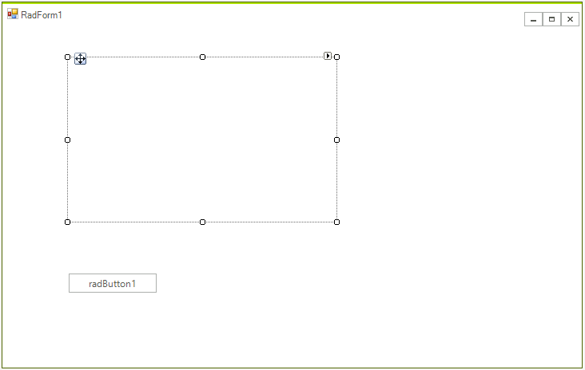
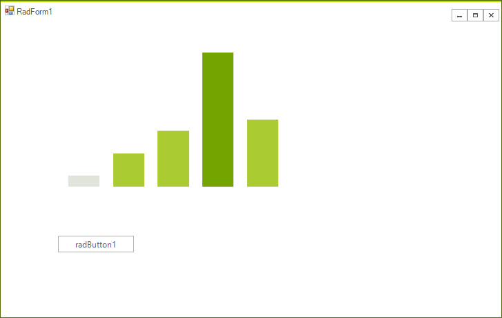

# Getting Started with WinForms Sparkline

1\. To start using the RadSparkLine first you need to place the control on the form. By default the control should look like a regular panel.



2\. Once the control is on the form go to the code behind and create a new __SparkBarSeries__. 

#### Adding SparkBarSeries to RadSparkline

{{source=..\SamplesCS\Sparkline\SparklineCode.cs region=GettingStarted}} 
{{source=..\SamplesVB\Sparkline\SparklineCode.vb region=GettingStarted}}
````C#
private void SparklineCode_Load(object sender, EventArgs e)
{
    var series = new SparkBarSeries();
    series.CategoryMember = "Category";
    series.ValueMember = "Values";
    series.DataSource = GetData();
    series.ShowHighPointIndicator = true;
    series.ShowLowPointIndicator = true;
    radSparkline1.Series = series;
}

````
````VB.NET
Private Sub SparklineCode_Load(ByVal sender As Object, ByVal e As EventArgs)
    Dim series = New SparkBarSeries()
    series.CategoryMember = "Category"
    series.ValueMember = "Values"
    series.DataSource = GetData()
    series.ShowHighPointIndicator = True
    series.ShowLowPointIndicator = True
    radSparkline1.Series = series
End Sub

````
 

{{endregion}} 


3\. Here is the method that returns the sample data as well.

#### Sample Data

{{source=..\SamplesCS\Sparkline\SparklineCode.cs region=SampleData}} 
{{source=..\SamplesVB\Sparkline\SparklineCode.vb region=SampleData}}
````C#
public static DataTable GetData()
{
    DataTable table = new DataTable();
    table.Columns.Add("Values");
    table.Columns.Add("Category");
    table.Rows.Add(1, "John");
    table.Rows.Add(3, "Adam");
    table.Rows.Add(5, "Peter");
    table.Rows.Add(12, "Sam");
    table.Rows.Add(6, "Paul");
    return table;
}

````
````VB.NET
Public Shared Function GetData() As DataTable
    Dim table As New DataTable()
    table.Columns.Add("Values")
    table.Columns.Add("Category")
    table.Rows.Add(1, "John")
    table.Rows.Add(3, "Adam")
    table.Rows.Add(5, "Peter")
    table.Rows.Add(12, "Sam")
    table.Rows.Add(6, "Paul")
    Return table
End Function

````
 

{{endregion}} 

4\. The RadSparkline now shows the data and indicates the high an low points.




## Telerik UI for WinForms Learning Resources
* [Telerik UI for WinForms Sparkline Component](https://www.telerik.com/products/winforms/sparkline.aspx)
* [Getting Started with Telerik UI for WinForms Components](https://docs.telerik.com/devtools/winforms/getting-started/first-steps)
* [Telerik UI for WinForms Setup](https://docs.telerik.com/devtools/winforms/installation-and-upgrades/installing-on-your-computer)
* [Telerik UI for WinForms Application Modernization](https://docs.telerik.com/devtools/winforms/winforms-converter/overview)
* [Telerik UI for WinForms Visual Studio Templates](https://docs.telerik.com/devtools/winforms/visual-studio-integration/visual-studio-templates)
* [Deploy Telerik UI for WinForms Applications](https://docs.telerik.com/devtools/winforms/deployment-and-distribution/application-deployment)
* [Telerik UI for WinForms Virtual Classroom(Training Courses for Registered Users)](https://learn.telerik.com/learn/course/external/view/elearning/17/telerik-ui-for-winforms)
* [Telerik UI for WinForms License Agreement)](https://www.telerik.com/purchase/license-agreement/winforms-dlw-s)

