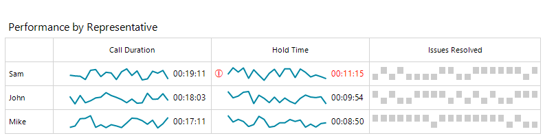

# Overview

The __RadSparkline__ control is lightweight chart that aims to present key information, the control is compact and provides excellent performance. __RadSparkline__ supports many features and can easily used in a grid view to summarize large amount of data.

 

# Features

* Series Types
    * [SparkAreaSeries]()
    * [SparkBarSeries]()
    * [SparkLineSeries]()
    * [SparkScatterSeries]()
    * [SparkWinLossSeries]()
* [Data Binding]()
* [Annotations]()
* [Indicators]()
* [Export To Image]()
* [Printing]()
* [Null Values Support]()