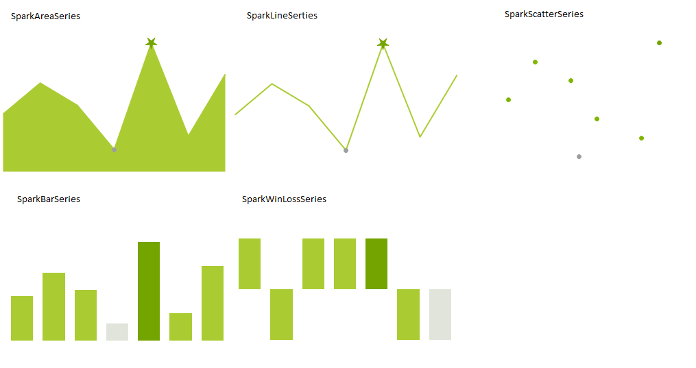

# Series Overview

>caption Figure 1: Supported Series

The currently supported series are:
* SparkAreaSeries
* SparkBarSeries
* SparkLineSeries
* SparkScatterSeries
* SparkWinLossSeries

## Common properties

All series inherit the __SparkSeries__ class. The following table shows the properties that are shared between all series types.

|__Property__|__Description__|
|---|---|
|__DataPoints__|Gets the data points collection.|
|__DataSource__|Gets or sets the data source of the SparkSeries.|
|__DataMember__|Gets or sets the name of the list or table in the data source for which the SparkSeries is displaying data.|
|__DisplayMember__|Gets or sets the display member.|
|__Name__| Gets or sets the name.|
|__HighValue__|Gets the high value data point.|
|__LowValue__|Gets the low value data point.|
|__ShowMarkers__|Gets or sets whether the points markers will be painted.|
|__MarkerBorderColor__|Gets or sets the border color of the points of the series.|
|__MarkerBorderWidth__| Gets or sets the border width of the points of the series.|
|__MarkerBackColor__|Gets or sets the back color of the points of the series.|
|__ShowHighPointIndicator__|Gets or sets whether the high point marker will be painted.|
|__HighPointBorderColor__|Gets or sets the border color of the high point of the series.|
|__HighPointBorderWidth__|Gets or sets the border width of the high point of the series.|
|__ShowLowPointIndicator__|Gets or sets whether the low point indicator will be painted.|
|__LowPointBorderColor__|Gets or sets the border color of the low point of the series.|
|__LowPointBorderWidth__|Gets or sets the border width of the low point of the series.|
|__LowPointBackColor__| Gets or sets the back color of the low point of the series.|
|__ShowFirstPointIndicator__|Gets or sets whether the first point indicator will be painted.|
|__FirstPointBorderColor__|Gets or sets the border color of the first point of the series.|
|__FirstPointBorderWidth__|Gets or sets the border width of the first point of the series.|
|__FirstPointBackColor__|Gets or sets the back color of the first point of the series.|
|__ShowLastPointIndicator__|Gets or sets whether the last point marker will be painted.|
|__LastPointBorderColor__|Gets or sets the border color of the last point of the series.|
|__LastPointBorderWidth__|Gets or sets the border width of the last point of the series.|
|__ShowNegativePointIndicators__|Gets or sets whether the negative point markers will be painted.|
|__NegativePointBorderColor__|Gets or sets the border color of the negative points of the series.|
|__NegativePointBorderWidth__|Gets or sets the border width of the last point of the series.|
|__NegativePointBackColor__|Gets or sets the back color of the negative points of the series.|

