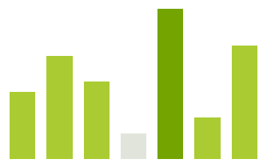

# SparkBarSeries

__SparkBarSeries__ are used to visualize data points as bar blocks where the height of each bar denotes the magnitude of its value. The following snippet demonstrates how to manually add SparkBarSeries.

#### Create SparkBarSeries

{{source=..\SamplesCS\Sparkline\SparklineCode.cs region=BarSeries}} 
{{source=..\SamplesCS\Sparkline\SparklineCode.vb region=BarSeries}}
 

{{endregion}} 

>caption Figure 1: SparkBarSeries

### The essential properties of SparkBarSeries are:

|__Property__|__Description__|
|---|---|
|__BaselineValue__|Gets or sets the value of the base line splitting the area into Win and Loss halves.|
|__HighValue__|Gets the high value data point.|
|__LowValue__|Gets the low value data point.|
