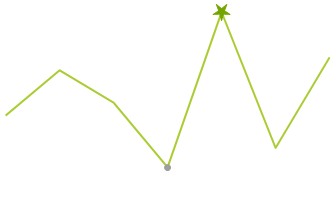

# SparkLineSeries

__SparkLineSeries__ plot their CategoricalSparkDataPoint on Cartesian Area. The following example shows how you can create the line series.

#### Create SparkLineSeries

{{source=..\SamplesCS\Sparkline\SparklineCode.cs region=LineSerires}} 
{{source=..\SamplesCS\Sparkline\SparklineCode.vb region=LineSerires}}
 

{{endregion}} 

>caption Figure 1: SparkLineSeries

### The essential properties of SparkPointSeries are:

|__Property__|__Description__|
|---|---|
|__MarkerSize__|Gets or sets the size of the points of the series.|
|__MarkerShape__| Gets or sets the shape of the points of the series.|
|__HighPointSize__|Gets or sets the size of the high point of the series.|
|__HighPointShape__|Gets or sets the shape of the low point of the series.|
|__LowPointSize__|Gets or sets the size of the low point of the series.|
|__LowPointShape__|Gets or sets the shape of the low point of the series.|
|__FirstPointSize__|Gets or sets the size of the first point of the series.|
|__FirstPointShape__|Gets or sets the shape of the first point of the series.|
|__LastPointSize__|Gets or sets the size of the last of the series.|
|__LastPointShape__|Gets or sets the shape of the last point of the series.|
|__NegativePointSize__|Gets or sets the size of the negative points of the series.|
|__NegativePointShape__|Gets or sets the shape of the negative points of the series.|

