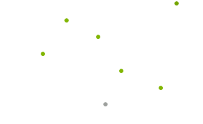

# SparkScatterSeries

Unlike Categorical series, ScatterSeries plots its data upon two numerical axes. Scatter series identify the position of each __ScatterDataPoint__ using two numerical values - __XValue__ and __YValue__ for the horizontal and vertical axes respectively, just like in the typical Cartesian coordinate system. Here is how to create two __SparkScatterSeries__ and populate them manually:

#### Create SparkScatterSeries

<snippet id='sparkline-sparklinecode-scatterseries-cs' />
<snippet id='sparkline-sparklinecode-scatterseries-vb' />

>caption Figure 1: SparkScatterSeries

### The essential properties of SparkScatterSeries are:

|__Property__|__Description__|
|---|---|
|__HighValue__|Gets the high value data point.|
|__LowValue__|Gets the low value data point.|

