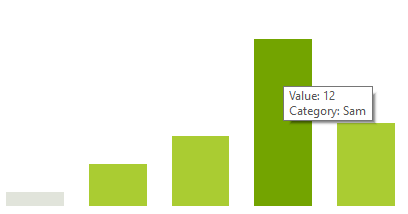

# Tooltips

The tooltips are supported out of the box and you just need to enable them.

#### Enable tooltips

{{source=..\SamplesCS\Sparkline\SparklineCode.cs region=EnableTooltips}} 
{{source=..\SamplesVB\Sparkline\SparklineCode.vb region=EnableTooltips}}

 
 

{{endregion}} 

The default tooltips will displayed when hovering over a particular data point. 

## Customizing Tooltip Text

You can use the __DataPointTooltipTextNeeded__ event to set custom tooltip text. The following snippet shows how you can access the event.

#### Subscribing to DataPointTooltipTextNeeded

{{source=..\SamplesCS\Sparkline\SparklineCode.cs region=TooltipController}} 
{{source=..\SamplesVB\Sparkline\SparklineCode.vb region=TooltipController}}

 
 

{{endregion}} 

The following example shows how you can set the text in the event handler.

#### Customizing the Tooltip Text

{{source=..\SamplesCS\Sparkline\SparklineCode.cs region=TooltipTextEvent}} 
{{source=..\SamplesVB\Sparkline\SparklineCode.vb region=TooltipTextEvent}}

 
 

{{endregion}} 

