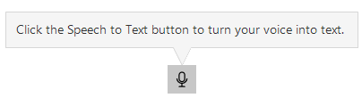
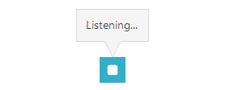

# SpeechToTextButton Appearance

The **RadSpeechToTextButton** appearance can be customized using the Telerik theming system and by configuring its visual elements. The control inherits appearance options from [Telerik UI for WinForms RadButton](), providing extensive styling capabilities.

## Animation 

The **RadSpeechToTextButton** displays a visual pulse animation when the button enters the listening state (`SpeechRecognizerState.Listening`). This animation provides immediate visual feedback to users, indicating that the speech recognition is actively listening for input. 

>note The pulse animation is enabled by default. The **AllowAnimation** property indicates whether the animation is enabled or not. 

If you want, you can disable the pulse animation by setting the **AllowAnimation** property to `false`.

#### Example: Disable the pulse animation

````C#
this.radSpeechToTextButton1.AllowAnimation = false;
````
````VB.NET
Me.RadSpeechToTextButton1.AllowAnimation = False
````

## Customizing the Tooltip

The **RadSpeechToTextButton** displays a tooltip (represented by a **[RadCallout]()** when the user hovers over it. This tooltip shows the current state of the button to provide visual feedback.

| Ready | Listening |
| :------------: | :-----------: |
|||


By default, the tooltip is displayed for the **Ready** and **Listening** states. You can customize the tooltip content and behavior using the **CalloutOpening** event.

### CalloutOpening Event

The `CalloutOpening` event allows you to customize the tooltip text or cancel the tooltip display based on the current state of the recognizer.

#### Customizing tooltip text based on state

````C#
private void RadSpeechToTextButton1_CalloutOpening(object sender, Telerik.WinControls.UI.SpeechToTextButton.SpeechToTextTooltipOpeningEventArgs e)
{
    var button = (RadSpeechToTextButtonElement)sender;
    
    if (button.State == SpeechRecognizerState.Ready)
    {
        e.ToolTipText = "Click here to start speaking";
    }
    else if (button.State == SpeechRecognizerState.Listening)
    {
        e.ToolTipText = "Launching listening mode";
    }
}

````
````VB.NET
Private Sub RadSpeechToTextButton1_CalloutOpening(sender As Object, e As Telerik.WinControls.UI.SpeechToTextButton.SpeechToTextTooltipOpeningEventArgs)
    Dim button As RadSpeechToTextButtonElement = CType(sender, RadSpeechToTextButtonElement)
    
    If button.State = SpeechRecognizerState.Ready Then
        e.ToolTipText = "Click here to start speaking"
    ElseIf button.State = SpeechRecognizerState.Listening Then
        e.ToolTipText = "Launching listening mode"
    End If
End Sub

````

To prevent the tooltip from opening, set the **e.Cancel** property of the event arguments to true.

#### Using the CalloutOpening event to cancel the tooltip opening

````C#
private void RadSpeechToTextButton1_CalloutOpening(object sender, Telerik.WinControls.UI.SpeechToTextButton.SpeechToTextTooltipOpeningEventArgs e)
{
    e.Cancel = true; // Cancel the default tooltip opening
}

````
````VB.NET
Private Sub RadSpeechToTextButton1_CalloutOpening(sender As Object, e As Telerik.WinControls.UI.SpeechToTextButton.SpeechToTextTooltipOpeningEventArgs)
    e.Cancel = True ' Cancel the default tooltip opening
End Sub

````

note You can also customize the RadCallout component by accessing it through SpeechToTextTooltipOpeningEventArgs.

## See Also

- [States]()
- [Getting Started]()
- [RadButton Appearance]()

