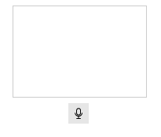

# Custom Speech Recognizer

The **RadSpeechToTextButton** allows you to use a custom speech recognizer by implementing the `IRadSpeechRecognizer` interface. This enables you to integrate third-party speech recognition services or create custom implementations tailored to your specific requirements.

## Implementing Custom Speech Recognizer

To create a custom speech recognizer, you need to create a CustomSpeechRecognizer class that implements the `IRadSpeechRecognizer` interface, which defines the contract for speech recognition functionality. 

The following example demonstrates a basic custom speech recognizer implementation:

#### Example: Implementing IRadSpeechRecognizer

````C#
public class CustomSpeechRecognizer : IRadSpeechRecognizer
{
    private const string MockText = "This is a mocked speech recognizer response for testing purposes and it will not really do a voice transcription in your system.";

    private SpeechRecognizerState state;
    private int reportingSessionId;

    public SpeechRecognizerState State
    {
        get => this.state;
        private set
        {
            if (this.state != value)
            {
                this.state = value;
                this.StateChanged?.Invoke(this, EventArgs.Empty);
            }
        }
    }

    public event EventHandler StateChanged;
    public event EventHandler<SpeechRecognizerErrorOccurredEventArgs> ErrorOccurred;
    public event EventHandler<SpeechRecognizerSpeechRecognizedEventArgs> SpeechRecognized;

    public Task Init(SpeechRecognizerInitializationContext context)
    {
        this.State = SpeechRecognizerState.Ready;
        this.reportingSessionId++;
        return Task.CompletedTask;
    }

    public Task StartListening()
    {
        this.State = SpeechRecognizerState.StartingListening;
        this.reportingSessionId++;
        int localSessionId = this.reportingSessionId;

        Task.Run(() =>
        {
            this.State = SpeechRecognizerState.Listening;
            int i = 0;
            string[] words = MockText.Split(' ', (char)StringSplitOptions.RemoveEmptyEntries);
            string fullText = string.Empty;

            while (true)
            {
                string word = words[i % words.Length];
                fullText += $" {word}";
                i++;

                Thread.Sleep(333);

                if (localSessionId != this.reportingSessionId)
                {
                    break;
                }

                this.SpeechRecognized?.Invoke(this, new SpeechRecognizerSpeechRecognizedEventArgs(fullText));
            }
        });

        return Task.CompletedTask;
    }

    public async Task StopListening()
    {
        this.State = SpeechRecognizerState.Ready;
        this.reportingSessionId++;
        await Task.Yield();
    }

    public Task Reset()
    {
        this.State = SpeechRecognizerState.NotInitialized;
        this.reportingSessionId++;
        return Task.CompletedTask;
    }

    public void Dispose()
    {
        this.reportingSessionId++;
        this.State = SpeechRecognizerState.Disposed;
        this.StateChanged = null;
        this.ErrorOccurred = null;
        this.SpeechRecognized = null;
    }
}

````
````VB.NET
Public Class CustomSpeechRecognizer
    Implements IRadSpeechRecognizer

    Private Const MockText As String = "This is a mocked speech recognizer response for testing purposes and it will not really do a voice transcription in your system."

    Private _state As SpeechRecognizerState
    Private reportingSessionId As Integer

    Public Property State As SpeechRecognizerState Implements IRadSpeechRecognizer.State
        Get
            Return Me._state
        End Get
        Private Set(value As SpeechRecognizerState)
            If Me._state <> value Then
                Me._state = value
                RaiseEvent StateChanged(Me, EventArgs.Empty)
            End If
        End Set
    End Property

    Public Event StateChanged As EventHandler Implements IRadSpeechRecognizer.StateChanged
    Public Event ErrorOccurred As EventHandler(Of SpeechRecognizerErrorOccurredEventArgs) Implements IRadSpeechRecognizer.ErrorOccurred
    Public Event SpeechRecognized As EventHandler(Of SpeechRecognizerSpeechRecognizedEventArgs) Implements IRadSpeechRecognizer.SpeechRecognized

    Public Function Init(context As SpeechRecognizerInitializationContext) As Task Implements IRadSpeechRecognizer.Init
        Me.State = SpeechRecognizerState.Ready
        Me.reportingSessionId += 1
        Return Task.CompletedTask
    End Function

    Public Function StartListening() As Task Implements IRadSpeechRecognizer.StartListening
        Me.State = SpeechRecognizerState.StartingListening
        Me.reportingSessionId += 1
        Dim localSessionId As Integer = Me.reportingSessionId

        Task.Run(Sub()
                     Me.State = SpeechRecognizerState.Listening
                     Dim i As Integer = 0
                     Dim words() As String = MockText.Split({" "c}, StringSplitOptions.RemoveEmptyEntries)
                     Dim fullText As String = String.Empty

                     While True
                         Dim word As String = words(i Mod words.Length)
                         fullText += $" {word}"
                         i += 1

                         Thread.Sleep(333)

                         If localSessionId <> Me.reportingSessionId Then
                             Exit While
                         End If

                         RaiseEvent SpeechRecognized(Me, New SpeechRecognizerSpeechRecognizedEventArgs(fullText))
                     End While
                 End Sub)

        Return Task.CompletedTask
    End Function

    Public Async Function StopListening() As Task Implements IRadSpeechRecognizer.StopListening
        Me.State = SpeechRecognizerState.Ready
        Me.reportingSessionId += 1
        Await Task.Yield()
    End Function

    Public Function Reset() As Task Implements IRadSpeechRecognizer.Reset
        Me.State = SpeechRecognizerState.NotInitialized
        Me.reportingSessionId += 1
        Return Task.CompletedTask
    End Function

    Public Sub Dispose() Implements IDisposable.Dispose
        Me.reportingSessionId += 1
        Me.State = SpeechRecognizerState.Disposed
        RemoveHandler StateChanged, Nothing
        RemoveHandler ErrorOccurred, Nothing
        RemoveHandler SpeechRecognized, Nothing
    End Sub
End Class

````

## Applying the Custom Recognizer

To use your custom speech recognizer with the RadSpeechToTextButton, set the **SpeechRecognizerCreator** property. This property accepts a factory function that creates and returns an instance of your custom recognizer.

````C#
this.radSpeechToTextButton1.SpeechRecognizerCreator = () => new CustomSpeechRecognizer();
````
````VB.NET
Me.RadSpeechToTextButton1.SpeechRecognizerCreator = Function() New CustomSpeechRecognizer()
````

This is the result of implementing the custom recognizer above:



>important Set the `SpeechRecognizerCreator` as early as possible to ensure your custom recognizer is used from the start.

