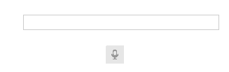

# Getting Started with SpeechToTextButton

This article demonstrates how to add the **RadSpeechToTextButton** control to your desktop application and configure it for speech recognition functionality. At the end of this tutorial, you will have a fully functional speech-to-text button that captures voice input and handle the recognized text.



## Setup Steps

1. Adding RadSpeechToTextButton to Your Form 

To start using the **RadSpeechToTextButton** control, just drag it from the Toolbox and drop it onto your form. Alternatively, you can add the control programmatically in your form's constructor or Load event handler.

#### Setting up a RadSpeechToTextButton

{{source=..\SamplesCS\SpeechToTextButton\SpeechToTextButtonGettingStarted.cs region=AddControl}} 
{{source=..\SamplesVB\SpeechToTextButton\SpeechToTextButtonGettingStarted.vb region=AddControl}}

````C#
 RadSpeechToTextButton speechToTextButton = new RadSpeechToTextButton();

````
````VB.NET
Dim speechToTextButton As New RadSpeechToTextButton()

````

2. Install Microsoft.Web.WebView2 NuGet package

Before using the RadSpeechToTextButton control, ensure that the **Microsoft.Web.WebView2** NuGet package (minimum version 1.0.3650.58) is installed in your project. When the button is first loaded, the WebView2 may prompt the user to grant microphone access and allow listening.

>note This package is required for the default speech recognizer functionality and can be downloaded from [nuget.org](https://www.nuget.org/packages/Microsoft.Web.WebView2).

3.  Handle the SpeechRecognized event to get recognized text

The **RadSpeechToTextButton** provides the **SpeechRecognized** event, which is raised each time the speech recognizer successfully processes audio input and converts it to text. This event is the primary mechanism for retrieving the transcribed text from the control.

````C#
private void RadSpeechToTextButton1_SpeechRecognized(object sender, Telerik.SpeechRecognizer.SpeechRecognizerSpeechRecognizedEventArgs e)
{
    string fullText = e.FullText;
}

````
````VB.NET
Private Sub RadSpeechToTextButton1_SpeechRecognized(sender As Object, e As Telerik.SpeechRecognizer.SpeechRecognizerSpeechRecognizedEventArgs)
    Dim fullText As String = e.FullText
End Sub

````

That's it! You now have access to the text that the RadSpeechToTextButton listens to. 

## Processing Recognized Text

Once the text is recognized in the **SpeechRecognized** event, you can display it in controls such as RadLabel, RadTextBox, and more.

>note More information about additional events available in the RadSpeechToTextButton, see the [Events]() article.

The `SpeechRecognizerSpeechRecognizedEventArgs` class provides the following detailed information about the recognized speech:

- **FullText**: Gets complete, accumulated, recognized text from the current listening session.
- **FullTextConfidenceScore**: Gets the confidence score for the recognized text. A value between 0 and 1 that indicates the confidence level of the transcription. Higher values represent greater confidence. A value of -1 indicates that no confidence score is available.

#### Using the SpeechRecognized event

````C#
 private void RadSpeechToTextButton1_SpeechRecognized(object sender, Telerik.SpeechRecognizer.SpeechRecognizerSpeechRecognizedEventArgs e)
 {
     if (e.FullTextConfidenceScore >= 0.5)
     {
         // High confidence - process the text
         this.radLabel1.Text = e.FullText;
     }
     else if (e.FullTextConfidenceScore < 0.5)
     {
         // Low confidence - notify user
         this.radLabel1.Text = "Low confidence: " + e.FullText;
     }
 }

````
````VB.NET
Private Sub RadSpeechToTextButton1_SpeechRecognized(sender As Object, e As Telerik.SpeechRecognizer.SpeechRecognizerSpeechRecognizedEventArgs)
    If e.FullTextConfidenceScore >= 0.5 Then
        ' High confidence - process the text
        Me.radLabel1.Text = e.FullText
    ElseIf e.FullTextConfidenceScore < 0.5 Then
        ' Low confidence - notify user
        Me.radLabel1.Text = "Low confidence: " + e.FullText
    End If
End Sub

````

## Continuous vs. One-Time Recognition

The RadSpeechToTextButton supports two recognition modes: [**Continuous Recognition (Default)**](#continuous-recognition-default) and [**One-Time Recognition**](#one-time-recognition). These modes allow you to control how the speech recognition process behaves.

The recognition modes are defined through the **IsContinuousRecognition** property, which indicates whether the speech recognizer operates in continuous recognition mode.

>note For more information about the internal states and lifecycle of the control, see the [States]() article.

### Continuous Recognition (Default)

By default, when you press the **RadSpeechToTextButton**, the control enters **continuous listening mode**. In this mode:

- The recognizer continuously processes speech input.
- The listening session remains active until you press the button again to stop.
- This mode is ideal for scenarios where you need to capture extended speech or multiple sentences.

### One-Time Recognition

To switch to **one-time recognition mode**, set the **IsContinuousRecognition** property to `false`. In this mode:

- The recognizer automatically stops after detecting a single utterance or a brief pause in speech.
- This mode is suitable for capturing short voice commands or text entries.


#### Use One-Time Recognition Mode
````C#
this.radSpeechToTextButton1.IsContinuousRecognition = false;

````
````VB.NET
Me.radSpeechToTextButton1.IsContinuousRecognition = False

````

## Language Support

The service used by the default WebView2 speech recognizer supports multiple languages. The default language comes from the current culture of the system, but this can be changed via the `LanguageTag` property. The property works with the IETF language tags (e.g., "en-US", "de-DE", "fr-FR", etc.).

````C#
 this.radSpeechToTextButton1.LanguageTag = "en-US";

````
````VB.NET
Me.RadSpeechToTextButton1.LanguageTag = "en-US"

````


## Telerik UI for WinForms Learning Resources

* [Getting Started with Telerik UI for WinForms Components](https://docs.telerik.com/devtools/winforms/getting-started/first-steps)
* [Telerik UI for WinForms Setup](https://docs.telerik.com/devtools/winforms/installation-and-upgrades/installing-on-your-computer)
* [Telerik UI for WinForms Application Modernization](https://docs.telerik.com/devtools/winforms/winforms-converter/overview)
* [Telerik UI for WinForms Visual Studio Templates](https://docs.telerik.com/devtools/winforms/visual-studio-integration/visual-studio-templates)
* [Deploy Telerik UI for WinForms Applications](https://docs.telerik.com/devtools/winforms/deployment-and-distribution/application-deployment)
* [Telerik UI for WinForms Virtual Classroom (Training Courses for Registered Users)](https://learn.telerik.com/learn/course/external/view/elearning/17/telerik-ui-for-winforms)
* [Telerik UI for WinForms License Agreement](https://www.telerik.com/purchase/license-agreement/winforms-dlw-s)
