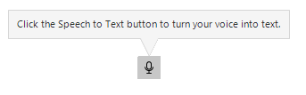

# WinForms SpeechToTextButton Overview

The **RadSpeechToTextButton** is a UI component that enables users to convert spoken words into text using online speech recognition services. Speech-to-text functionality enhances user experience by providing hands-free data entry, accessibility enhancements, and enabling natural interaction via voice command with applications. 

When the user clicks the button, the control activates a speech recognition service, listens for voice input, and transcribes the recognized speech into text. The recognized text then can be displayed in a text field, processed by your application logic, or used to trigger specific actions based on voice commands.

## Prerequisites

To use the SpeechToTextButton in your application, ensure the following requirements are met:

* **Telerik UI for WinForms**: A valid license and installation of Telerik UI for WinForms.
* **Internet Connection**: Active internet connectivity is required as the control uses online speech recognition services.
* **Microphone Access**: A functioning microphone or audio input device, with appropriate permissions granted to the application.
* **Speech Recognition Service**: By default, the control uses  **Microsoft.Web.WebView2 Services**. You need to configure the service endpoint, or implement a custom recognizer for other services.

## Key Functionality and Features

The RadSpeechToTextButton provides the following functionality and features:

* **[Speech Recognition]()**: Converts spoken words to text using the WebView2 Speech API.
* **[Continuous Recognition](#continuous-vs-one-time-recognition)**: Supports continuous listening mode for extended dictation sessions or one-time recognition for short commands. 
* **[Real-time Transcription]()**: Delivers recognition results as the user speaks.
* **[State Management]()**: Provides visual feedback and programmatic access to the recognizer's current state.
* **[Event Handling]()**: Offers a comprehensive event model for capturing recognized text and tracking state changes.
* **[Language Configuration](#language-support)**: The SpeechToTextButton allows you to set the language for speech recognition, ensuring accurate transcription of spoken words into text.
* **[Custom Speech Recognizer]()**: Allows integration with third-party speech recognition services by implementing a custom recognizer interface.
* **Styling and Appearance**: Full customization support through the Telerik theming system, allowing you to adjust colors, borders, and visual properties.

## Next Steps

* [Getting Started with Telerik UI for WinForms SpeechToTextButton]()

## Telerik UI for WinForms Learning Resources

* [Telerik UI for WinForms API Reference](https://docs.telerik.com/devtools/winforms/api/)
* [Getting Started with Telerik UI for WinForms Components]()
* [Telerik UI for WinForms Virtual Classroom (Training Courses for Registered Users)](https://learn.telerik.com/learn/course/external/view/elearning/17/TelerikUIforWinForms) 
* [Telerik UI for WinForms Forum](https://www.telerik.com/forums/winforms)
* [Telerik UI for WinForms Knowledge Base](https://docs.telerik.com/devtools/winforms/knowledge-base)

## Telerik UI for WinForms Additional Resources
* [Telerik UI for WinForms Product Overview](https://www.telerik.com/products/winforms.aspx)
* [Telerik UI for WinForms Blog](https://www.telerik.com/blogs/desktop-winforms)
* [Telerik UI for WinForms Videos](https://www.telerik.com/videos/product/winforms)
* [Telerik UI for WinForms Roadmap](https://www.telerik.com/support/whats-new/winforms/roadmap)
* [Telerik UI for WinForms Pricing](https://www.telerik.com/purchase/individual/winforms.aspx)
* [Telerik UI for WinForms Code Library](https://www.telerik.com/support/code-library/winforms)
* [Telerik UI for WinForms Support](https://www.telerik.com/support/winforms)
* [What’s New in Telerik UI for WinForms](https://www.telerik.com/support/whats-new/winforms)

