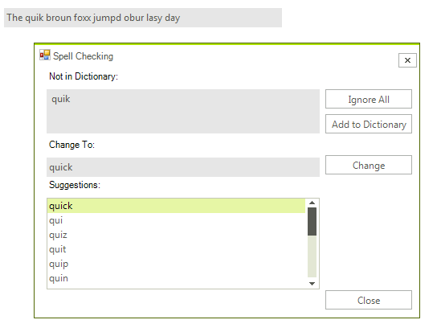

# Getting Started 

The following tutorial demonstrates how you can make **RadSpellChecker** check a simple text-editing control - **RadTextBox**.
       
>important Before executing the following steps, please make sure that the target framework of the project in which you are going to use **RadSpellChecker** is .NET Framework 4.0. This will allow you to see **RadSpellChecker** in your Toolbox and work with it.
>
 
1\. Drag and drop **RadTextBox** from your Toolbox to your form.

2\. Drag and drop **RadSpellChecker** from your Toolbox to your form.

3\. Drag and drop **RadButton** from your Toolbox to your form. When clicked this button will invoke the spell-checking capabilities of **RadSpellChecker**.       

4\. Set the text of **RadTextBox** so that it contains some typos, for example:

#### Initialize RadTextBox with some text

{{source=..\SamplesCS\SpellChecker\SpChGettingStarted.cs region=settingText}} 
{{source=..\SamplesVB\SpellChecker\SpChGettingStarted.vb region=settingText}} 

````C#
this.radTextBox1.Text = "The quik broun foxx jumpd ovur lasy dog";

````
````VB.NET
Me.RadTextBox1.Text = "The quik broun foxx jumpd ovur lasy dog"

````

{{endregion}} 


5\. Subscribe to the **Click** event of **RadButton**. In the event handler call the **Check** method of **RadSpellChecker** and pass the **RadTextBox** instance as a parameter:

#### Spellcheck the RadTextBox

{{source=..\SamplesCS\SpellChecker\SpChGettingStarted.cs region=callingCheck}} 
{{source=..\SamplesVB\SpellChecker\SpChGettingStarted.vb region=callingCheck}} 

````C#
private void radButton1_Click(object sender, EventArgs e)
{
    this.radSpellChecker1.Check(this.radTextBox1);
}

````
````VB.NET
Private Sub RadButton1_Click(ByVal sender As Object, ByVal e As System.EventArgs) Handles RadButton1.Click
    Me.RadSpellChecker1.Check(Me.RadTextBox1)
End Sub

````

{{endregion}} 

Now when you press the button, **RadSpellChecker** form will appear with the appropriate suggestions for the mistaken words:

>caption Figure 1: Spellchecking form



# See Also

* [Spellchecking Modes]()	


