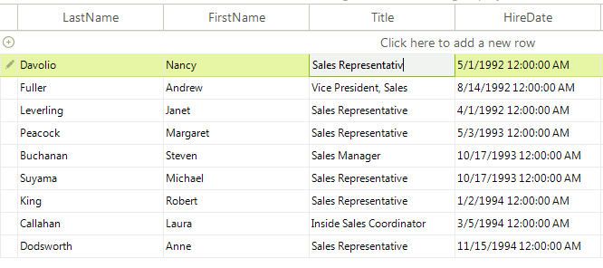
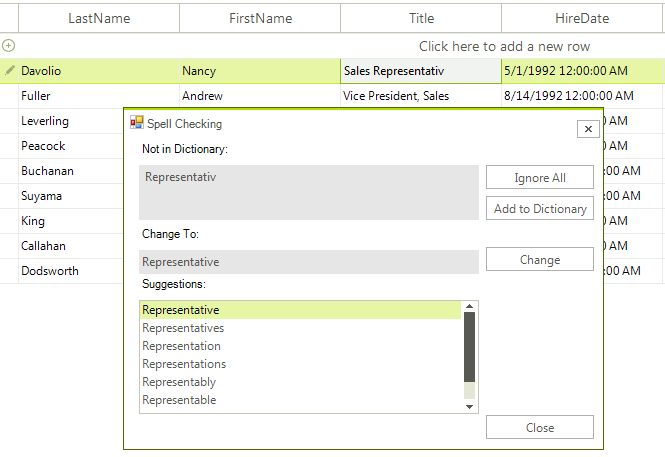
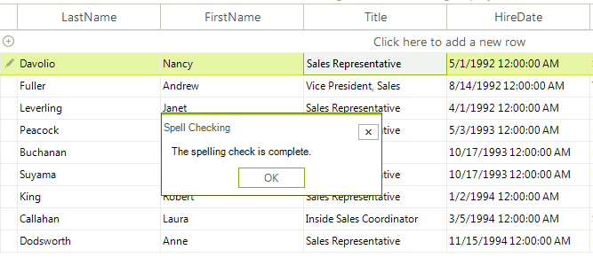
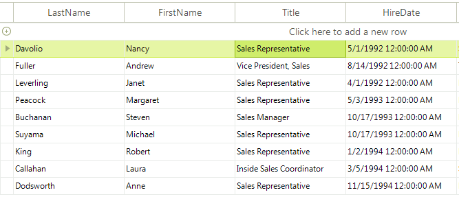

# SpellChecking RadGridView

**RadSpellChecker** is not limited to checking only simple text-editing controls such as **RadTextBox**. It can spell check editors in more complex controls such as **RadGridView** as well.
      
Here is a sample scenario: the end-user types something in **RadTextBoxEditor** in **RadGridView** and tries to commit the typed text in the cell. This is the place where **RadSpellChecker** should appear and correct the misspelled words.  After a confirmation given by the end-user on the **RadSpellChecker** form, the editor should close and the corrected values should be committed to the edited cell.
      
Supposing that we have a **RadGridView** filled with data and a **RadSpellChecker** on the form, the following steps demonstrate how to implement the given scenario:
      
1\. Let's subscribe to **CellValidating** event. This event is fired when the edited cell should be validated before the editor for that particular cell is closed. In this event we should call the **Check** method of **RadSpellChecker** passing the currently opened editor:

#### Spell check RadGridView's editor

<snippet id='spellchecker-spchwithradgridview-validating-cs' />
<snippet id='spellchecker-spchwithradgridview-validating-vb' />

Please note that the editor sets the corrected value to the opened editor, but not directly to the underlying data cell. We save this editor value in a variable named '*correctedValue*'   

2\. Now we should subscribe to the **CellEndEdit** event which is fired after the editor is closed. In this event we should pass the saved corrected value to the data cell:

#### Save the corrected value

<snippet id='spellchecker-spchwithradgridview-cellendedit-cs' />
<snippet id='spellchecker-spchwithradgridview-cellendedit-vb' />

The following figures provide the end-user experience with **RadSpellChecker** and **RadGridView**:
      

1. The end-user types '*Sales Representativ*':

    

1. Then the end-user tries to commit the misspelled value by pressing the Enter key. As a consequence, the **RadSpellChecker** form is invoked:

    

1. After the user chooses one of the suggestions and presses the `Change` button, the **RadSpellChecker** form disappears, leaving an informative message box that the spell checking operation is completed:

    

1. The end-user pressed the `OK` button. Then, the message box disappears, the editor closes and the corrected value is saved in the cell:

    

# See Also

* [Spellchecking Modes]()	
