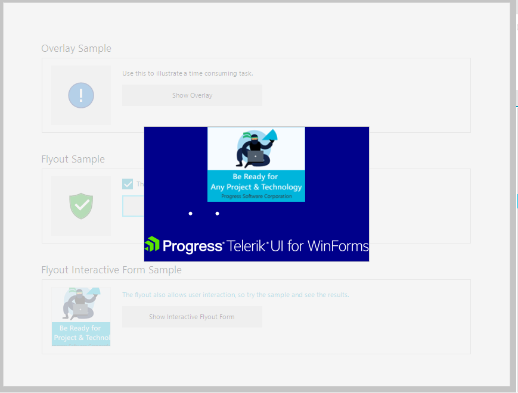

# Getting Started

This tutorial will walk you through how you can use __Flyout Screen__. 



The Flyout screen can be activated through the __RadFlyoutManager.Show()__ method. This method accepts two parameters. The first one is the control which the flyout will appear on top of it. The second parameter is the type of user control that will be used as content. The flyout screen can be used as a notification pop-up to notify for long-running operations or as a message box in which can be placed input control. The second option can be used in scenarios where additional information is required from the end user to continue using the application. In both cases, we can close the flyout screen by calling the __RadFlyoutManager.Close()__ static method. 

## Show Flyout

{{source=..\SamplesCS\SplashScreens\Flyout\FlyoutSettings.cs region=GettingStarted_Show}} 
{{source=..\SamplesVB\SplashScreens\Flyout\FlyoutSettings.vb region=GettingStarted_Show}} 

````C#

RadFlyoutManager.Show(this.radGridView1,typeof(MyUserControl));
	

````
````VB.NET

RadFlyoutManager.Show(Me.radGridView1, GetType(UserControl1))


````

{{endregion}}

## Close Flyout

{{source=..\SamplesCS\SplashScreens\Flyout\FlyoutSettings.cs region=GettingStarted_Close}} 
{{source=..\SamplesVB\SplashScreens\Flyout\FlyoutSettings.vb region=GettingStarted_Close}} 

````C#

RadFlyoutManager.Close();
	

````
````VB.NET

RadFlyoutManager.Close()


````

{{endregion}}

 
        
